# C语言的初级认识

子曰：温故而知新，可以为师矣。

这是我第二遍学习C语言的笔记，鄙人能力有限，有不对的地方欢迎批评指正。

## 初识C语言

​	C语言是一种高级编程语言，但是也可以像汇编这种低级语言一样对硬件进行操作，不过相对于汇编，C语言让编程不再受制于具体的某个CPU的指令集，而且对于程序员更友好，毕竟C语言起初设计时的想就是要让该语言面像程序员，而在制定C语言的标准时美国国家标准协会就在制定C标准的指导原则中就表述过：

​		﹒信任程序员

​		﹒不要妨碍程序员做需要做的事

​		﹒保持语言精炼简单

​		﹒只提供一种方法执行一项操作

​		﹒让程序更快，即使不能保证其可移植性（这是因为当时制定标准的专家们觉得：作为实现，应该针对目标计算机来定义最合适的某特定操作，而不是加强一个特定、统一的定义。实际上，C的可移植性很强，只要不是针对特殊硬件设备或操作系统特殊功能编写的部分都可以移植。）


## C语言能干什么？

​	按照我师傅讲的，C除了不能生孩子，剩下的都能干。

​	当然，这是开玩笑的话，不过C在编程界的能力确实如此，游戏开发、物联网、操作系统、软件开发、音视频领域、一些高级语言的解释器、嵌入式、网络安全、写病毒……都可以用C语言来实现。

​	不过C语言虽然强大，但不是万能的，相对于一些更高级的语言（如Python等）C程序的编写还是相对困难的。实际上，我们会针对不同的需求来选择不同的编程语言来实现。

## 关于对编程的认识

​	对于编程的本质的哲学思考，我不想讨论太多。编程嘛，就是编写个程序来完成你想做的事情（这只是狭义的面向计算机的编程，实际上编程的核心思想可以运用于来完成一切事情，它可以让你做事更加有序，让你头脑清晰，做事不慌，稳如老狗）。

​	不过咱们既然就是来学计算机程序的开发，那就得简单讲讲计算机的历史了：

（这是我很早以前写的，就直接复制过来了，我觉得写的挺好，就懒得重写了（主要是懒））

### 计算机发展的历史

对于计算机的学习，应该从了解它的历史发展开始，以此才能理解代码的前因后果。不过咱也不是专业学历史的，咱就随便讲讲吧。

​    计算机是怎么产生的？这个答案很显然，是为了满足人对于计算的要求而产生的，这就是计算机的缘起。所以说白了，计算机就是用来计算的莫有感情的工具罢了，不要以为这东西有多高级！  一开始，人们只需要计算诸如1+1=2这种数量级很小、计算量也很小的问题，这人脑就能瞬间算出来，显然是不需要什么计算机的。但是当数量级与运算量大了起来的时候，人脑算起来就比较慢了，除非在数学上给出了什么特殊的方法，比如说等比、等差数列的求和，这本来是一个浩大的工作量，但是数学上却给出了求和公式，这就极大程度地减少了计算量。遇到等比、等差数列的求和还好说，要是让你对一个不规则数列求和那恐怕就很麻烦了，实际上现实生产、工作中经常要处理这种问题，而这种问题对人类来说，说简单吧，它就是去做个加法；说难吧，计算量又太大。于是人类就想办法把自己从这种无聊且枯燥的工作中解脱出来。

 

​    于是1820年，人类开始着手设计第一台计算机——差分器。在当时，工业还没有这么发达，连电子管都没有，所以这第一台计算机其实是靠齿轮来工作的，我要是没记错这是用来计算平方根用的，好像是可以计算到小数点后五位，并且这个机器笨重的要死，好像随随便便就好几吨。（一看当时华罗庚先生就没出生，在现代，通过他给出的方法，我们在纸上就可以轻松地做到，何必动用这么大的成本呢？）

 

​    差不多到了20世纪了，人们终于发明了二进制计算机，就是用电子来表达数据，这东西快呀！但是由于当时技术确确实实拉的一批，电平的高低是用电子管来实现的，这东西造价贵极了，体积大（小则拳头大小，大则一米多高，一台计算机要有上万个电子管，所以这个计算机差不多得有三层楼高），耗能高，后面得有一整座发电厂跟着供能。除此以外还极度不易于维护，差不多梅一小时就烧掉一个晶体管，这还是内部人员极力维护的结果。 知道有一个词叫bug吧？bug本意就是小飞虫、扑棱蛾子。那么它又是如何演变成“计算机产生的错误”的这个意思呢？原因是当年咱们还在用电子管计算机的时候，一只扑棱蛾子飞到了计算机的电路里，工作人员满楼层找，终于在计算机的某处发现了这只被电成了焦炭的扑棱蛾子，并把它粘到了自己的工作笔记上，这是人类历史上第一次的计算机error，从此bug就被赋予了这个意思。而在前面加上前缀de，就有消灭的意思，故debug就是消灭bug的意思。

 

​    再过了几年，人们又发明了晶体管，计算机的体积被缩小了，耗能减小了，性能增加了，不过这时候计算机还没有操作系统，反正就那点内存，也没啥好管理的。到了后来集成电路的发展，计算机内存什么的都提上来了，就得需要管理了，就好像你家要是就20平米，那就不需要雇个管家什么的了，家中的资源自己就能管理过来，但要是你家有10086平米，那就得雇个管家了是吧？不然你一天连地面都扫不完，更别提去干其他事情了。就这样，有操作系统的计算机产生了。


​    到了现代，科学家们发现，我们还有更高效的用来表示数据与处理数据的方法，比如说用基因来存储数据，用种种细胞来作CPU（当然了，这是种比较草率的说法，但这里仅为了了解历史，不偏重科技）。再比如说量子计算机，普通的计算机在一个时间，只能表示0或1之中的其中一种状态；量子计算机则不然，它可以同时表示0或1好几个状态。就好像向我这种情感上的菜鸡就只能一次跟一个姑娘谈恋爱，但是海王可以同时跟还几个姑娘谈恋爱，这就大大的提升了谈恋爱的效率，对于量子计算机亦复如是。

### 编译的流程

​		通常来讲，编程可分7步走：

#### 1、定义程序目标

​	就是要明白你要拿计算机干什么，要拿计算机完成什么任务。这一步就叫定义程序的目标，就是来设定一下KPI（这一步特别适合让科幻作家来构想）

#### 2、设计程序

​	就是想想如何实现你上一步设想的那个目标，即设计一种算法来实现这个目标，必要的话定义一种方便该算法实现的数据结构，毕竟  程序=数据结构+算法 。

#### 3、编写代码

​	算法写好了，数据结构也定义好了，接下来就是根据你写的算法咔咔一顿敲就好了。这里写的代码是给编译器看的源代码。

#### 4、编译

​	这一步分为两步：编译和链接，这种事情交给编译器这个牛马去干就好了，顺便还能看看你上一步写的代码有没有语法错误，有语法错误会报错，然后根据报错信息 自上而下 修改就好了。（注意，一定要先改上面的代码，底下的错误可能是上面的错误导致的。）

#### 5、运行程序

​	运行程序，看看程序能不能跑，有没有达到你的预期。

#### 6、测试和调试程序

​	程序要是能运行，但是它并没有按照你的理想去运行，就像你的女朋友永远也不会听你的话，如同那脱缰野马语言神经错乱式的运行了，此时你就得调试了。而这就是代码中的逻辑错误导致的，除了debug一顿调试外别无他法（当然了，如果就是几百行的小程序那当我没说，逻辑错误自己也可以检查（虽然有些痛苦））

#### 7、维护和修改程序

​	程序不能固步自封，就好像女朋友不能只有一个（不想谈多个女朋友的男人不是好男人，因为他没有雄心壮志，自然无法直挂云帆济沧海）。当你发现可以用更优秀的算法去实现时，你就得回去修改了。或者你又想到了原本目标并不完美，你就得去再写个算法来扩充实现该项目。


## 第一个C程序

```C
//程序源码的书写框架
#include<stdio.h>  //引入头文件stdio.h，头文件的作用就是来调用函数库，这里调用的printf()函数就包含在stdio.h里
#include<conio.h>  //同理，用来调用_getch()
				   //上面这种以#开头的文件都是预处理指令，由编译器处理，不由后面生成的.exe文件执行
// C语言中，万物一函数也，程序与操作系统的对接是由函数来完成的，而main函数就是程序与操作系统的接口，
// main函数就是程序说话的嘴巴,为程序的入口
int main()  
{
	printf("Hello,world!\n"); //向窗口输出打印Hello,world!，并自动敲了一下回车（"\n"就是回车的意思）
	_getch();  //强行卡住窗口，防止转瞬即逝

	return 0;  // 如果main函数正确执行，就将0返回给操作系统，否则返回一个非0的奇怪的值
			   // 这个是main函数的出口，毕竟不能一直说话是吧，在这里函数说话的嘴就被关上了
}  // 用花括号将main内的代码全框起来，表示这个框框内的代码（代码块）都归main函数管，这个代码块就是main函数的函数体
```


# 编译环境的说明

​	这个就不写了，自己搜个教程就好，这里用的是visual studio 2013 。接下来的代码都是基于此开发环境实现的。在其他开发环境上可能略为不同。配置管理器设置为：

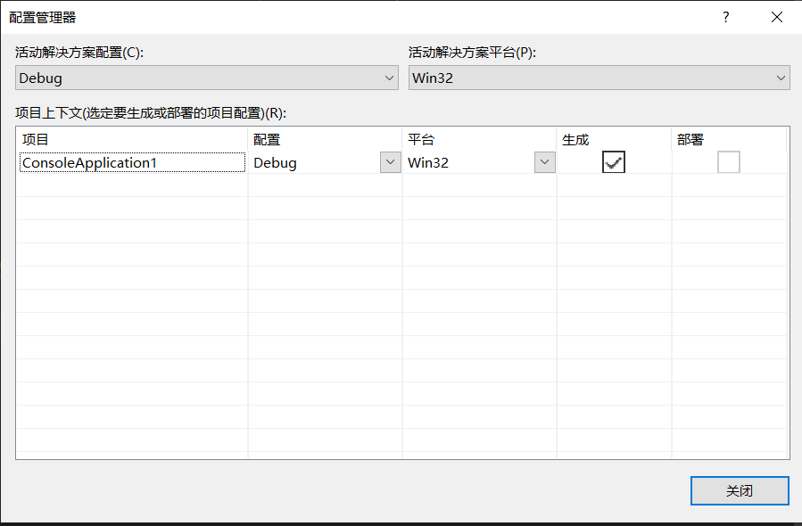

​	创建的项目类型皆是Win32控制台应用程序（这样程序的结果可以直接在控制台上运行，而不是由编译器虚拟出来一个控制台窗口），创建空项目，取消安全周期检查（初学阶段要这么干的）。步骤如下图所示：

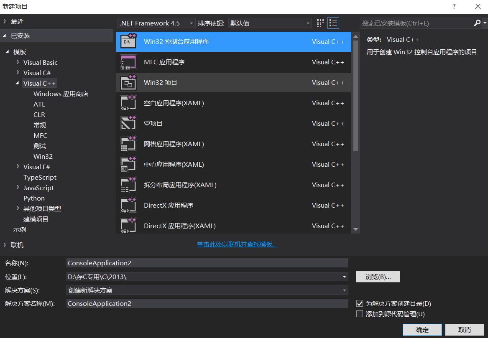

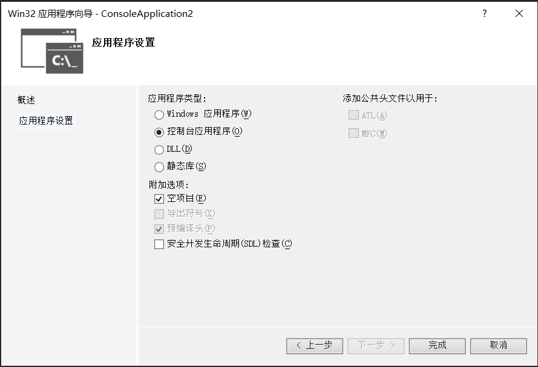


# C语言的基本知识与基操

## 数据类型（为什么要有数据类型）

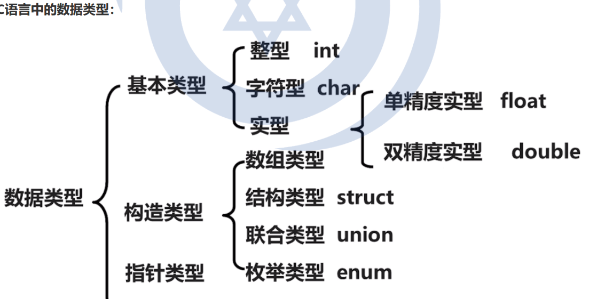

​	数据就是能存入计算机并能被计算机处理的东西的总称，那么为什么要给数据分类，然后搞出数据类型这个东西呢？这是因为计算机工作模式的原因。计算机的本质就是辅助人类计算、管理数据的工具，这一点它和算盘与账本并没有什么区别，也正如算盘需要上面的珠子来表示数，靠珠子的拨动表示数据的运算一样，计算机需要用二进制位来存储数据，靠CPU来完成运算。所以计算机的运算与人类的运算不同，人类的运算是直接在脑子里完成的，是纯粹理性的，比如算个1+2，人脑就是直接1+2=3，这是一种先天综合判断，并不需要其他什么东西来进行数据的表示与运算。但是计算机需要！还拿计算1+2举例：计算机中的CPU需要从内存块一中读取数据 1，然后把它读进寄存器a中；再从内存块二中读取数据2，然后把她读进寄存器b中，然后把寄存器a、b相加，结果存到寄存器a中。

​	而计算机要处理的数据显然不只有数字，还有字符呀，还有表示其他东西的信息呀。不过你既然被存到计算机里了，那就别管是什么东西，就都是以01011100010这种二进制的形式保存的，这一点众生平等，尚无例外。

​	而数据既然是以二进制形式进行存储的，那么如何进行读写操作呢？毕竟要真的是一位一位的访问，那数据是不是会有点乱呀？所以就有了存储单元这个东西，它把内存这个大酒店划分成了一个个的小房间，而这些小房间都是等大的。而酒店为了容纳更多的客人是不是就得对房间的大小进行限制，以此来规划出更多的房间让客人进行居住呀？那么内存单元多大合适呢？  后来经过计算机科学家的研究与实践，发现一存储空间定为8个二进制位（8 bit，1 byte（字节））最合适，所以之后世界上几乎所有的计算机就都把8 bit当成一个存储单元了。

​	但是很快就发现，既然都是以二进制的形式存在，比如说 0111 0000 转换成十进制后就是112呀，这说明这样表示整数很容易，那么如何表示负整数呢？如何表示小数呢？好像光靠这些bit位没法直接表示出来。不过聪明的计算机科学家们找到了方法，就是把不同位置的二进制位赋予不同的含义，以此表示不同的数据类型，比如下面说的int 整形，它在内存中通常占4 byte，32 bit，将最高位设置成符号位来表示正负，最高位为0就是正，为1就是负，后面31 bit用于存储变量的具体大小 。表示小数时亦复如是，也是将不同的bit位赋予不同的含义，以此来表示小数。而字符型是计算机科学家们编出了一个对照表，让不同的值表示不同的字符，C语言中最常用的就是ASCII表。 （这些在后面会详细进行学习，这里就先不写那么详细，知道底层原理就行。）

​	说白了，就是程序需要按照不同的方式存储和处理数据，所以就有了数据类型的划分。

## 基本数据类型

​	而所谓基本数据类型就是由C语言自身给出的，不需要你去定义的数据类型，你直接拿来用就好了。实际上，之所以说他基本，是因为其他数据类型几乎都是在这些基础上产生的。

C中有如下几种基本数据类型：

### 整形

​	就是用于表示整数的数据类型，具体有短整型（short）、整形（int）、长整形（long int （经常简写为long））、长长整形（long long int（可简写为 long long）），这些都是用来表示整数的，区别在于他们所占的内存大小不一样，表示的数的范围也不一样。而这些数据类型在不同编译器中占的空间大小可能不太一样，在你的编译器中可以用sizeof关键字查看（单位，字节）：

```c
#include<stdio.h>
int main()
{
    printf("short：%d\n", sizeof(short));
	printf("int：%d\n", sizeof(int));
	printf("long：%d\n", sizeof(long));
	printf("long long：%d\n", sizeof(long long));
}
```

运行结果如下图所示：

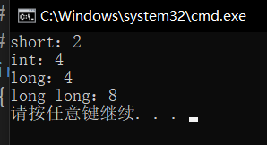

这说明，在该开发环境下，该类型的数据占用内存大小就是这么大。

​	而以上整形都是有符号整形，即最搞二进制高位为符号位，其他位用于表示数的大小。如果不想最高位为符号位，让更多的比特位去表示这个数本身（扩大了数的正向表示范围，但是自此无法表示负数） 

​	当不想让最高位表示符号位时可以用unsigned 修饰（实际上，unsigned 只能修饰整形和字符型）。


### 浮点型

​	浮点型用来表示小数，C语言中，依精度而分，产生了两种浮点型：

​		1、单精度浮点型（float），占4 byte

​		2、双精度浮点型（double），占8 byte


### 字符型

​	字符型，用于表示字符，就一种 char ，占1 byte 。通过与ASCII码表进行对照将二进制数字转换成字符。不过值得一提的是最高位仍然为符号位。

​	还有一件事（老爹附体），中文在计算机中其他码表进行储存，由于中国字的数量实在是比较多，所以就一个8 bit的内存空间铁定是无法表示全的，所以中文字符实际上一个是占2 byte 的，故char型本质上是无法储存汉字的。（不会报错，但是可能会随机生成乱码）


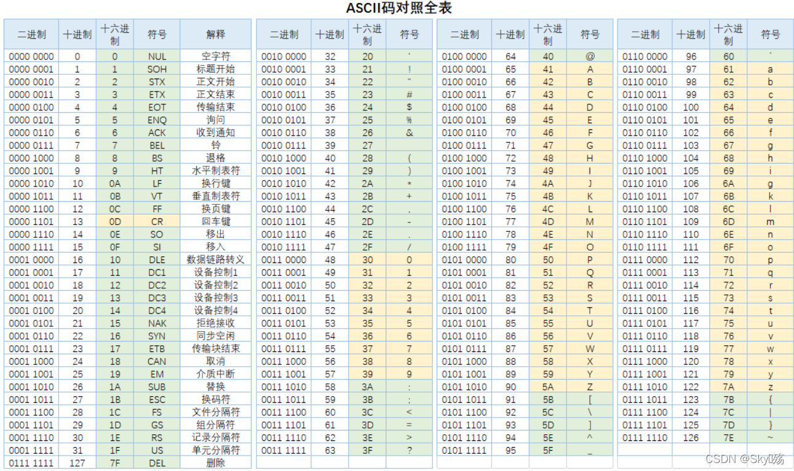


### 布尔型（需要编译器支持C99标准）

​	用来表示真值，0为假(false)，1为真(true)。（实际上，C语言中非0即是真），占1 byte。

​	关键字 _Bool

上述数据类型的所占内存大小：

```C
#include<stdio.h>
int main()
{
	printf("float：%d\n", sizeof(float));
	printf("double：%d\n", sizeof(double));
	printf("bool：%d\n", sizeof(_Bool));
	printf("char：%d\n", sizeof(char));
}
```

运行结果

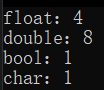


## 常量与变量

​	所谓常量就是直接被表明的量；所谓变量，就是得改变的量。（极度的粗浅的说一下，一会儿还得那10086目的砂纸打磨圆润一下）

### 常量

​	**在程序运行过程中，其值不能被改变的量称为常量。**例如：数字1、2、3、0.1、3.14和字母'a'、'b'等。
数值常量就是数学中的常数。

常用的常量分为以下几类：
（1）整型常量：如1、2、3、10000、0、-100、(56)O、(8A)H等都是整型常量。

（2）实型常量：有两种表示形式
①十进制小数形式：由数字和小数点组成。如：123.456、0.789、-12.34、0.0、10.0等；

②指数形式：如12.34e3（表示12.34103）、 -67.89e-16（表示 -67.8910-16）等。由于计算机输入或输
出时无法表示上标和下标，所以规定以字母e或E代表以10为底的指数，需要注意的是e和E之前必须要有
数字，且e和E后面必须为整数，不能写成e4 、12e2.5 。  （了解就好，现实工作中不会哪个不长眼的将实型变量写的他妈都不认识，实际上，要是在一些大公司，这种人都没法过面试。）

（3）字符常量：有两种形式的字符常量
①普通字符常量：用单引号括起来的一个字符，如：’a’，’B’，’3’，’@’，’#’。不能写成’ab’或’12’，注意单引号只是个界限符，字符是指用单引号括起来的符号，不包括单引号。字符型在内存中是以ASCII码形式存储的，例如字符’a’的ASCII码的十进制为97，在存储单元中存放的是97的二进制形式。

②转义字符：C语言中还有一种特殊形式的字符常量，是以字符\开头的字符序列。例如：’\n’换
行、’\t’水平制表符（tab）、’\’’单引号、’\”’双引号、’\?’问号、’\’斜杠、’\a’警告声音提示、’\b’退格删除
符、’\f’换页符、’\r’回车、’\v’垂直制表符、’\o’八进制形式、’\x’十六进制形式等。转义字符的意思是将’\’后面的字符转换成另外的意义。如’\n’中的n不代表字母n，而是作为换行符。


（4）字符串常量：

如"ABC"、"123"等，用双引号把若干个字符括起来，字符串不包括双引号。注意不能写成'abc'、'123'，单引号内只能包含一个字符，表示字符常量；双引号内可以包含一串字符，表示字符串常量。

（5）符号常量：用#define指令指定用一个符号代表一个常量。
如：#define PI 3.1415926（**注意末尾没有分号**）
也就是用PI代替3.1415926，意思很简单，代表圆周率。
使用符号常量可以让常量在使用时含义更清楚，并且在需要改变程序中多处用到了同一个常量的时候，
能够做到“一改全改”。

注意不要把符号常量误认为变量。
（6）地址常量：每一个常量、变量、数组的地址在程序运行期间是不能够改变的，称为地址常量。


​	**FBI WARNING**： 虽然变量经过const修饰后值不可改变，但是本质上还是变量。（尽管有些书会把他说成常变量，但是他不可用于数组的定义，起码在VS2013、2022中它无法用于数组的定义，在上述的开发环境下，数组的定义工作必须由常量完成。）


### 变量

​	**变量就是在程序运行中，值可以改变的量。**
​	变量代表一个有名字的、具有特定属性的一个存储单元，可以用来存储数据，也就是变量的值。
​	变量必须先定义后使用。变量名的命名规则应符合标识符命名规则。
​	什么是标识符？
​	标识符用来标识和区分我们所定义的各种数据量，标识符命名规则：只能由字母、数字、下划线’_’组
成，并且只能由字母和下划线开头。 
同一个作用域范围内定义的标识符不允许重名，不允许是关键字。  

注意：变量不能以 # 开头，因为 # 不是用于定义变量的字符。


定义变量的格式：

​	TypeName Name；

如：

​	int a;

​	double b;


注意：

​	尽量避免变量重名的问题，在同一作用域内不同变量无法定义成一个名字，会报错，但是在不同作用域可以。并且在程序运行的时候会采取就近原则，即先调用此作用域内的同名变量。而为了让代码可读，咱们尽量不要让变量名相同，这样可以让代码更易懂，为后续工作带来便利。  毕竟咱们写代码要遵守易读的原则，而不是将代码写的像学校出的考试题一样，可读性极差，只能说这样虽然合法但有病。


### 关于常量的存储问题

#### 我们声明的常量会被存到内存中吗？

​	问了一下我老师 ，在程序运行之后也是被存到内存中的。

​	对于一个程序来说，内存有4个区域，分别是栈区，堆区，全局区，代码区：

栈区：用来存局部变量、函数的参数等。

堆区：由程序员向系统申请的一块内存，主要用于动态内存分配。

全局区（静态区）：用于保存全局变量、static修饰的静态变量等。

代码区：存代码的。

​	**而程序运行后常量就是被放在全局区的。**

#### 编译器是如何确定常量的类型的呢？

​	上面也说了，我们需要告诉电脑该如何、存储数据，故数据存于电脑之中就必须得由一种数据类型来储存它，那么编译器是如何来确定该常量的数据类型的呢？

这里引用一下我老师给的文章：

​	 在C语言中，不仅变量有类型，常量也是有类型的。为什么要把常量分为不同的类型呢？在程序中出现
的常量是要存放在计算机中的存储单元中的，这就必须确定分配给它多少字节，按什么方式存储。例
如，程序中有整数16，在编译器中会分配给它4个字节，按补码形式存储。
​	怎样确定常量的类型呢？从常量的表示形式即可判定其类型。

（1）符号常量：对于符号常量来说很简单，只要看到由单引号括起来的单个字符或转义字符就是字符常
量,以ACSII码值进行存储，占1个字节。

（2）整型常量：不带小数点的数值是整型常量，但要注意其有效范围。如果某系统中为整型数据分配2
个字节，其表示范围为-32768~32767（-2^16~2^16-1），如果在程序中出现数值常量12345，则系统
把它作为int型处理，用4个字节存放。如果出现数值常量45678，由于其大于32767，2个字节放不下，
所以系统就会把它作为长整型（long int）进行处理，分配4个字节。以此类推，如果出现的数值常量超
过4个字节的表示范围的话，系统就会把它当作长长整型（long long int）。
在整数的末尾加上大写字母L或小写字母l，则表示它是长整型（long int）。例如123L、666l等。在VS
编译环境中int和long int数据都分配4个字节，因此没有必要用long int。如果在整数的末尾加上大写字
母LL或小写字母ll，则表示它是长长整型（long long int），其在内存中占8个字节。

（3）浮点型常量：凡是以小数形式或指数形式出现的实数，都是浮点型常量，在内存中以指数形式存
储。如：0、10为整型常量，0.0、10.0是浮点型常量。注意：对于浮点型常量，编译器默认是按双精度
进行处理的。例如：float a=3.14159；在编译时，给float变量分配4个字节，而对于浮点型常量
3.14159来说，则是按double型处理，分配8个字节，编译器有时会发出“警告”。这种警告一般不会影响
程序运行结果，但是会影响程序运行结果的精确度。
可以在常量的末尾加一个F或f，强制指定常量的类型为单精度。如果在实型常量的末尾加一个L或l，就
是指定此常量为long double类型。（这说明也可以人工指定。）
注意：区分类型与变量、变量与常量的概念  


## 格式化输入输出函数

### 1、有关数据输入和输出的概念

​	从之前的每个程序看来，几乎每一个C程序都包含输入和输出。因为程序要进行运算，就必须给出数
据，而运算的结果当然也需要输出了，便于人们应用。没有输出的程序是没有意义的，输入输出是程序
中最基本的操作之一。

讨论程序的输入和输出时首先要注意：
	所谓的输入输出是以计算机主机为主而言的。
	计算机向输出设备（如显示器、打印机等）输出数据称为输出，从输入设备（如键盘、磁盘、光盘、扫
描仪等）向计算机输入数据称为输入。
	C语言函数库中提供了一批“标准输入输出函数”，它是以标准的输入输出设备（一般为终端设备）为输入、输出对象的。其中有：printf,scanf,putchar,getchar,puts,gets等函数。
	在使用这些库函数时，要在程序文件的开头用预处理指令#include把相关头文件（如：stdio.h    math.h    string.h    windows.h 等）加载进本程序中。
	这里需要  #include<stdio.h>


### 2、用printf函数输出数据（格式化输出函数）

printf函数的一般格式为：
	printf(格式控制，输出列表);

例如：printf(“%d,%c\n”,n,c);
括号内包括两个部分：
①格式控制
	格式控制是用双引号括起来的一个字符串，称为“转换控制字符串”，简称“格式字符串”。
它可以包含两个信息：
	●格式声明：又称为格式占位符由%和格式字符组成，用作将输出的数据转换为指定的格式然后输出。格
式声明符总是由‘%’字符开始的。
	常用的格式声明符有：
%d（十进制），%o（八进制），%x（十六进制），%u（无符号十进制），%c（单个字符），
%s（字符串），%f（单精度），%lf（双精度），%e（科学计数法），%i（自适应整数类型），
%g（自适应浮点类型）。
●普通字符：即需要在输出时原样输出的字符。
如：\n、\t、空格、逗号等。

```C
printf(“a=%d\n”,a);   //这里的a=和\n是原样输出的，a=1’\n’
```


②输出列表  

​	输出列表就是程序需要输出的一些数据，可以是常量、变量或表达式。
​	格式化输出函数printf是个函数，所以“格式控制字符串”和“输出列表”实际上都是函数的参数。
printf函数的一般形式可以表示为：printf(“参数1”,参数2,参数3,…,参数n);
参数1是格式控制字符串，参数2~参数n是所需要输出的数据。

**我们还可以自定义输出的分隔符和输出的格式。**
	如：

```C
printf(“%d %c %f\n”,a,b,c);
printf(“%d,%c,%f\n”,a,b,c);
printf(“%d\t%c\t%f\n”,a,b,c);
printf(“%4d\t%5.2f\n”,a,b);
```

​	**%4d和%5.2f中的4和5.2是在格式声明中用来指定输出数据的域宽（所占列数）的，如%6d，是指定输**
**出的整型数据占6列，%8.3f，是指输出的浮点型数据总共占8列，其中小数占3列，小数点占1列。还可**
**以在域宽数字前加一个’-’号，用于使输出左对齐。** 不过指定输出格式后会四舍五入。

### 3、用scanf函数输入数据（格式化输入函数）

scanf函数的一般格式为：
scanf(格式控制,地址列表);

​	其中“格式控制”的含义与printf函数相同。“地址列表”是由若干个地址组成的列表，可以是变量的地
址，或者是字符串的首地址。

使用格式化输入函数scanf时，需要注意以下几点：
	①函数的地址列表是以变量的地址作为参数的时候，变量名前面必须加一个取地址符号’&’，用于取此变量的地址，否则会出错。如：

```C
scanf(“%d %f %c”,a,b,c);  //err
```

是错误的。


​	②如果在“格式化控制字符串”中除了格式声明符以外还有其他字符，则应在输入数时在对应位置上输入与这些字符对应的相同的字符。

​	如有

```c
scanf(“a=%d,b=%f,c=%c”,&a,&b,&c);
```

则要想输入1,2,3，则应输入：a=1,b=2,c=3(回车) （注意这里的a=、b=、c=和逗号’,’）。当然，其中的格式可以自己定义，如可以用空格’ ’隔开，还有输入时间的时分秒可以用’:’隔开等。

**这里特别要注意字符和字符串的输入问题**。

```C
scanf（“%c%c%c”,&a,&b,&c）;
// 输入x y z，则a=‘x’，b=‘ ’，c=‘y’；应连续输入xyz。
// 输入输出函数数据之间的格式化间隔符（空格、TAB、回车或非法数据（“%d”，12A）等）
// 非格式间隔符（‘，’、‘！’等任意间隔符）；使用非格式间隔符时需要在输入的时候也用此间隔符分隔。
```

​	**③在输入数值型数据时，如输入空格、回车、tab键或非法字符（除scanf格式声明中指定的）等不属于**
**数值的字符，则认为此数据输入结束。**
如：

```C
scanf("%d%c%f" , &a,&b,&c); //输入: 34a567.8b9 , 则：a=1234,b=’a’,c=567.8    //&取址符
```

​	④scanf函数中double型数据需要使用%lf才能正常得到所输入的值，而输出可以用%f输出。
​	⑤在输入时也可以进行域宽控制
如：

```C
scanf("%3d%4d" , &a,&b);   // 输入12345678，则a=123，b=4567；
```

***注意各种类型的数据混合输入存在的问题**


### 4、字符型数据的输入和输出

​	①putchar字符输出函数
如：

```C
putchar(a);   //输出字符型变量a的值； //putchar('a');
```

​	②getchar字符输入函数
如：

```C
ch=getchar();                       //从键盘输入一个字符，存入字符变量ch中。
printf("%c",getchar());          //也可在格式化输出语句中直接输出所接收的字符
```

​	由于scanf、getchar等输入函数没有从键盘接收到数据就不会继续执行，所以在程序中可以起到与
system("pause");函数类似的暂停效果。（但是还是  system("pause");  的效果更好）


## 运算符与表达式


### 一、算术运算符和算术表达式

#### 1、基本的算术运算符

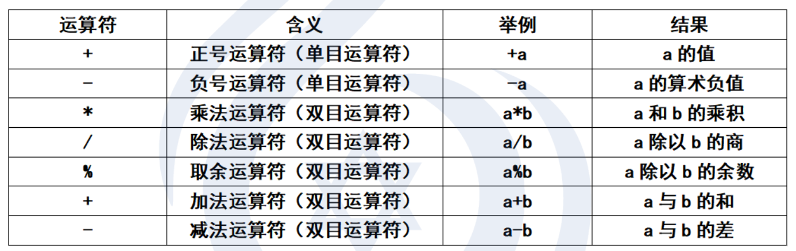

说明：
	由于键盘没有×号，运算符×以代替。*
	由于键盘没有÷号，运算符÷以/代替（反斜杠）。\斜杠
	整数相除的结果仍为整数。如：-5/3结果为-1（向0取整，舍去小数）。5.0/3=1.666666
	%（取余运算符）**要求参加运算的运算对象（即操作数）为整数**，结果也为整数。如8%6结果为2。（思考一下8.0%6=？）除%以外运算符的操作数都可以是任何算术类型。

#### 2、自增、自减运算符（单目运算符）

++（自增运算符）、--（自减运算符）

例如：
	++i；--i；（在这条语句使用i之前，先使i的值加（减）1，先加减后使用）
	i++；i--；（在这条语句使用i之后，使i的值加（减）1，先使用后加减）

​	粗略地看，++i和i++的作用都相当于i=i+1。但是++i和i++的不同之处在于：++i是先执行i=i+1，再使用i的值；而i++是先使用i的值，再执行i=i+1。

```C
//例如：
int i=1,j;
j=++i;  //i的值先+1变成2，再赋值给j，j的值为2
j=i++;  //先将i的值赋值给j，j的值为1，然后再将i的值+1变成2
//又例如：
int i=3；
printf(“%d”,++i); //输出4
printf(“%d”,i++); //输出4，i=5；
```

​	注意：++和--运算符只能用于变量，而  **不能用于常量或表达式**，如5++或--（i+j）等。

​	使用++和--的时候，会出现一种情况，如i+++j，是理解成（i++）+j呢？还是理解成i+（++j）呢？为了避免二义性，可以加一些“不必要的括号”，如（i++）+j

​	不要写++i + （++i）+ i++这种错误代码，这种代码虽然编译器不会报错，但是在这里我们无法通过操作符的属性来确定程序运行的唯一路径，这属于未定义行为，而未定义行为在编译时可以通过的，但是不同的编译器的处理结果是不同的，咱们要避免去写这种坑爹代码！

​	还有一件事！除了自加自减操作符和赋值运算符会改变变量自身的值以外，其他的都不改变变量自身的值。

#### 3、算术表达式与运算符的优先级和结合性

什么叫算术表达式呢？
	用算术运算符和括号将运算对象（操作数）连接起来的、符合C语法规则的式子，就称为C语言算术表达
式。运算对象包括常量、变量、函数等。例如：（a+b）c/d-1.5+‘a’。

C语言规定了运算符的优先级和结合性。
	与数学运算符的优先级和结合性类似，乘、除、模（*、/、%）运算符的优先级要高于加减（+、-），结合方向都是“从左至右”，同一优先级的运算符，按结合性依次执行。

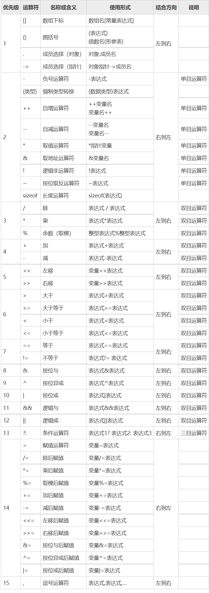

#### 4、不同类型数据间的混合运算(隐式转换)

在程序运行中，经常会遇到不同类型的数据进行运算，如6+8.8。如果一个运算符的两侧数据类型不同，
则先自动进行类型转换，使二者具有同一种类型，然后进行运算。因此整型、实型、字符型数据间可以
进行混合运算。

（1）+、-、、/运算的两个操作数进行运算，如果其中有一个数位float或double型，结果是double
型，因为系统将所有float型数据都先转换为double型，然后进行运算的。

（2）如果是int型与float或double型数据进行运算，先把int型和float型数据转换为double型，然后
再进行运算，结果为double型。

（3）字符型（char）数据与整型数据进行运算，就是把字符的ASCII码与整型数据进行运算。如：
10+’A’，由于字符A的ASCII码为65，就相当于10+65，等于75，字符型数据可以直接与整型数据进行运算。如果字符型数据与实型数据进行运算，则将字符对应的ASCII码转换为double型数据，然后进行运
算。

（4）整型（int）与无符号整型（unsigned）之间进行运算，以无符号整型为准，先把int型数据转换
为unsigned型，然后再做运算。
以上转换是隐式类型转换，是编译系统自动完成的，用户不必过问。

​	实际上，若是不同数据类型进行计算，那么计算机会先将其统一成相同的数据类型然后再进行计算的。那么转换规则是什么呢？

原则是：高字节向低字节转换；有符号型向无符号型转换；整形向浮点型转换。


例题：给定一个大写字母，要求输出其对应的小写字母。

参考代码：

 [大小写转换.cpp](参考代码\大小写转换.cpp) 

#### 5、强制类型转换运算符

C语言中可以运用强制类型转换运算符将一个表达式转换成所需的类型。
例如：
	(double)a
	(int)(x+y)
	(float)(5%3)
	(int)6.8%3
强制类型转换的一般格式为：(类型名)(表达式)


注意：

​	表达式应该用括号括起来。

​	如果写成：(int)x+y，则只是将x转换成整型，然后再与y相加。如果想要将表达式x+y的值转换为整型，应写成(int)(x+y)。

​	强制类型转换后的值只是临时值，不对数据本身操作。

### 二、C语言运算符

​	实际上，运算符也是一函数，以其运算结果为返回值（这一点在C++中显而易见）。


​	除了算术运算符以外，C还提供了其他运算符，共分为以下几类：
（1）算术运算符 （+、-、、/、%、++、--）加、减、乘、除、模、自增、自减

（2）关系运算符 （>、<、==、>=、<=、!=） //真（1）或假（0）逻辑值

（3）逻辑运算符 （&&、||、！）//与、或、非 

逻辑运算符中有个需要注意的地方：

​		对于逻辑与、非，程序在执行时会偷懒：

```c
	int i = 0;
	// 逻辑与，自左向右结合，全真则真，有假就假，所以左方出现假值（0）时就不再对右方进行运算
	int res1 = i++ && i++ && i++;
	printf("res1=%d\ti=%d\n", res1,i); //所以之后i的值是1而不是3

	// 逻辑或，自左向右结合，全假则假，有真就真，所以左方出现真值（1\非0）时就不再对右方进行运算
	int j = 0;
	int res2 = ++j || ++j || ++j;
	printf("res2=%d\tj=%d\n", res2, j);//所以之后j的值是1而不是3
```

（4）位运算符 （左移<<、右移>>、按位非~、按位或|、按位异或^、按位与&）

位操作更符合计算机的逻辑，所以他会更快。

**注意：操作数必须是整形，否则会出错。**

（5）赋值运算符 （=及其扩展赋值运算符+=、-=、=、/=、%=等）等于

（6）条件运算符 （? :）(表达式1)?(表达式2):(表达式3) 三目运算符


（7）逗号运算符 （，）int a,b,c,d;a=1,2,3;b=(1,2,3);起到分隔参数的作用。


（8）指针运算符 （、&）int p,a;p=&a;p=1;使指针变量p指向a的地址*

这个后面详细讲。

（9）求字节数运算符 （sizeof()）int a=10;,sizeof(int);//4,sizeof(a);//4

（10）强制类型转换符 （（类型名））int a=10,b;float c=11.11;b=a+(int)c;

（11）成员引用符 （.、->）结构体或共用体的成员引用符

（12）下标运算符 （[]）数组元素下标int a[10]; a[0]=1;a[1]=2;

（13）其他运算符  操作数：  （如函数调用运算符()，复合语句符{}，语句结束符;等）

​	操作数是运算符操作的实体，是表达式的一个组成部分，它规定了运算指令中进行数值运算的量。
这些运算符根据操作数的不同，而分为了单目运算符、双目运算符和三目运算符。

如：

```C
	int x,y;
	x = 1;       //其中x和1分别是赋值运算符=的左操作数和右操作数
	y = x++;  //其中y和x++分别是赋值运算符=的左操作数和右操作数，而x又是自增运算符++的左操作数。
```


运算符的优先级：

​	通常意义上来说（广义）单目>双目>三目。

​	算术运算符>关系运算符>逻辑运算符>条件运算符>赋值运算符>逗号运算符


### 三、C语句

​	一个C语言程序由若干个源程序文件组成，一个源文件由若干个函数和预处理指令以及全局变量声明部
分组成。如一个函数有数据声明部分和执行语句，其都是由语句组成的。语句的作用使向计算机系统发
出操作指令，要求执行相应的操作。一个C语句经过编译后产生若干条机器指令。**C程序的基本组成单位是函数，而函数又由一条或多条C语句构成。而简单的C语句必须以分号';'作为结束标志。**

#### 1、最基本的语句——赋值语句

​	在C语言中最常用的语句就是赋值语句和输入输出语句了。其中最基本的就是赋值语句，程序中的计算
功能大部分是由赋值语句实现的，几乎每个有实用价值的程序都包括赋值语句。

##### （1）赋值运算符’=’

与数学中的’=’不同的是，在C语言中，’=’为赋值运算符，它是用来将一个数据赋值给一个变量的。如
a=1;的作用是执行一次赋值操作（赋值运算），把1赋值给变量a。也可以将一个表达式的值赋值给一个
变量，如a=1+2;a=b+c+1;等。

##### （2）复合的赋值运算符

在赋值运算符=之前加上其他运算符，可以构成复合的运算符。
主要有：+=、-=、=、/=、%=这几种复合赋值运算符。
例如：x+=y; x=x+y; x=y; x=x*y;
x+=y+1;就相当于x+=(y+1); x=x+(y+1);
x=y+1;就相当于x=(y+1); x=x(y+1);

##### （3）赋值表达式和赋值语句

右值和左值
左值应该为可修改的变量，右值可以为任意符合规范且赋值有效的表达式。
a=1；
a=b=c=1;//a=1;b=1;c=1;
a=(b=1)+(c=2);//a=3;b=1;c=2;
a=(b=1)(c=2);*
赋值运算符是按照“从右至左”的结合顺序运行的。

##### （4）变量赋初值

在变量定义时对变量赋值就称为变量赋初值，也称为变量的初始化赋值。
int a=1;


#### 2、C语句的分类

C语句分为以下5类：

##### （1）表达式语句

​	表达式语句是由一个表达式加一个分号构成，最典型的是由赋值表达式构成的赋值语句。例如：a=3是
赋值表达式，而a=3;是赋值语句。

##### （2）控制语句

​	控制语句是由流程控制表达式组成的语句，用于完成一定的流程控制功能。

C语言提供9种控制结构语句，它们分别为：
①if()…else… （选择结构）
②for(;;)… （循环结构）
③while()… （循环结构）
④do…while(); （循环结构）
⑤break; （结束整个循环）
⑥continue; （结束本次循环，执行下次循环）
⑦switch （多分支选择结构）
⑧return ; （函数返回语句）

⑨goto （跳转语句，在结构化程序中最好不要用goto语句）


（对于上述的xx结构，后面会讲）

##### （3）函数调用语句

例如：

```c
printf("hello world!");
```

这是一个简单的调用输出函数的语句。其中printf("hello world!")是一个函数调用，加一个分号’;’就是
函数调用语句了。

##### （4）空语句

空语句就是：
；
只有一个分号的语句。（啥也不执行）

##### （5）复合语句(语句块)

在C语言中可以用{}把一些语句括起来，形成一条复合语句（又称为语句块）。
如：

```c
{
	int a,b,c;
	a=1;
	b=2;
	c=3;
}
```

​	**复合语句需要注意变量的作用域问题，其常用于选择分支结构和循环结构等控制语句中，其目的是让控制语句可以控制多条语句，达到我们想要的效果。**


## 选择结构和循环结构

​	C语言是面向过程的编程语言，而计算机科学家们后来就将一个程序的结构归纳为了三种，即：顺序结构、选择结构和循环结构。这些就是C语言中的基本控制结构，它们控制着程序的执行。

​	而对于顺序结构已经由只允许编译器自上而下的读代码（除非遇到goto语句）这种工作模式就已经实现了，接下来说一说剩下的就好了。

### 一、选择结构

​	在很多情况下，需要根据某个条件是否满足来决定是否执行指定的操作任务，或者从给定的两个或多个
操作选择其中一个执行，这就需要用到我们的选择结构了。

C语言提供了两种选择结构：if语句和switch语句。

#### 1、if语句

If语句的一般形式：
if（表达式）语句1;
[else 语句2;]

​	根据if语句的一般形式，可以写成不同的形式，最常用的有以下三种形式：

（1）

​		if(表达式)语句1; //单独的一个if语句，用于实现两个分支的判断选择
如：

```c
if(a>10)  printf("a大于10\n");   //如果条件a>10为真，则输出"a大于10"  (满足条件就执行)
```

（2）

​		if(表达式)语句1; //if和else组合，用于实现两个分支的判断选择

​		else 语句2;
如：

```c
if(a>10) printf("a大于10");    //如果条件a>10为真，则输出"a大于10"
else printf("a不大于10");       //否则输出"a不大于10"
```

（3）

​		if(表达式)语句1; //if else嵌套，用于实现多分支结构
​		else if(表达式)语句2; //if和else的配对问题，就近原则
​		else if(表达式)语句3; //else和前面最近的没有配对的if配对
​		else语句4；……
如：

```c
if(a>10)  printf("a大于10");             //如果条件a>10为真，则输出"a大于10"
else if (a=10) printf("a等于10");     //否则如果a=10为真，则输出"a等于10"
else  printf("a小于10");                   //否则输出"a小于10"
```


​	由上述可知：if可以单身，但是else不行。所以我们要向if学习，形成自己独立的人格，有对象可，无对象亦可，八风吹不动，常坐紫金莲！


例题1：

​	从键盘输入一个年份，判断其是否为闰年。
提示：闰年是指能被4整除并且不能被100整除（普通闰年），或者能被400整除的年份（世纪闰年），
否则就为平年。

参考代码：

 [闰年.c](参考代码\闰年.c) 

#### 2、switch语句

switch语句的一般形式：
switch(判断条件)
{
	case 常量1：语句1；
	case 常量2：语句2；
	case 常量3：语句3；
	……
	case 常量n：语句n；
	default：语句n+1;
}
如：

```c
switch(n)
{
	case ‘a’：printf("n的值为a")；break; //如果n等于'a'，则输出"n的值为a"
	case ‘b’：printf("n的值为b")；break; //如果n等于'b'，则输出"n的值为b"
	case ‘c’：printf("n的值为c")；break; //如果n等于'c'，则输出"n的值为c"
	case ‘d’：printf("n的值为d")；break; //如果n等于'd'，则输出"n的值为d"
	//break为跳出语句
	default：printf("xxxxxxxxxxx")；  //若n的值不满足上述任何一种case，则从此处开始执行
}
```

​	switch语句中，表达式的类型应与case语句后的常量类型保持一致，并且switch的判断条件只能为整型或字符型，case后面为常量表达式。

例题2：从键盘输入的学生成绩（0~100分），给学生的成绩评定等级。优秀（成绩>=90）、良好（90>
成绩>=80）、及格（80>成绩>=60）和不及格（成绩<60）。
（1）用if语句实现
（2）用switch语句实现

参考代码：

 [成绩（if实现）.c](参考代码\成绩（if实现）.c) 

 [成绩（switch实现）.c](参考代码\成绩（switch实现）.c) 

### 二、循环结构

​	在程序所处理的问题中，我们常常会需要重复处理同一类操作，这样我们就需要循环控制它们的执了。

#### 1、循环结构的分类

##### （1）当型循环

当循环条件满足时才执行循环体中的语句。

###### ①for循环

for循环的一般格式为：
	for(表达式1;表达式2;表达式3) //注意：表达式之间的分隔符;不能少
	//表达式1：条件初始化 //表达式2：循环继续的条件 //表达式3：改变循环条件
	{
		循环体;
	}

如：

```c
for(int a=0;a<10;a++) //循环输出数字0到9
printf(“a=%d\t”,a);
```


###### ②while循环

while循环的一般格式为：
	while(表达式)
	{
		循环体;
	}
如：

```c
char ch = 'a';
while(ch<='z')      //循环输出小写字母'a'到'z'
printf(“%c\t”,ch++);
```

##### （2）直到型循环

直到条件不满足时才结束循环。

do while循环

do while循环的一般格式：
	do
	{
		循环体;
	}while(表达式);
如：

```c
char ch = 'Z';
do      //循环逆序输出大写字母'Z'到'A'
{
printf("%c\t",ch--);
}while(ch>='A');
```

#### 2、当型循环和直到型循环的区别

当型循环：当条件满足时才执行循环
直到型循环：直到条件不满足时才结束循环，至少会执行一次循环体。
例题：输出以下图案：

```
******
 ******
  ******
   ******
    ******
     ******
```

参考代码：
 [打印图案.c](参考代码\打印图案.c) 

### 三、跳转语句

1、break语句
	跳出整个循环。

2、continue语句
	跳出本次循环，继续执行下次循环。

3、goto跳转
	goto语句支持跳转到指定的位置。


基本格式：
	标记:

​		一些代码

​	goto 标记; //执行goto语句后，会跳转到标记的指定位置

​	由于goto语句使程序执行的流程变复杂，不利于结构化程序的结构控制和意义的理解，所以一般不使用
goto语句。

### Homework

使用循环和分支结构判断一个数是否为素数。
（1不是素数，素数是指大于1的自然数，除了1和该数自身外，无法被其他自然数整除的数。）

参考代码：

 [找素数.c](参考代码\找素数.c) 


## 数组

### 数组是干什么的？

​	我们写程序的时候，经常会碰到要一次性创建一堆相同的数据类型的数据，那我们挨个进行声明与定义的话是不是太麻烦了？于是数组就应运而生了。

​	数组是将某种数据在内存中进行连续储存的一种存储结构，任何一种数据类型都可以使用数组。

### 一维数组

#### 一维数组的定义

基本格式：

​		TypeName Name[value]；

如：

```C
int arr[100]; //连续声明100个int型，数组名为arr
float farr[20];
double darr[30]={0};  //将darr中的圆度都初始化为0  （数组的赋值用 {} ）
int arr2[]={0,1,2,3};  //若初始化时[]内不填数字，但是声明的同时初始化了，
								//那编译器会根据{}中的元素个数自动填充
```

#### 一维数组元素的访问

基本格式：

​		数组名[下标];
如：

```c
S[0]=1;
S[1]=S[0];
S[10]=S[0]+S[1];
```

注意：
（1）数组名的命名规则和变量名相同，要遵循标识符的命名规则。
（2）在定义数组时，需要指定数组中元素的个数，也就是数组的长度，在定义数组时[]方括号中必须是
常量表达式，可以包括数值常量和符号常量。如：int a[6+8]; char b['a'];
（3）在C语言中数组下标是从0开始的，如：S[0]代表第一个数组元素。下标需要是一个确定的整数值，
所以下标可以是常量、变量、表达式，下标的范围：0 ~ 数组元素个数-1。
（4）整个数组的内存大小为：元素个数*单个元素类型所占字节数
sizeof(数组名); //求数组所占内存大小  

#### 一维数组的初始化

​	为了使程序简洁，常在定义数组的同时，给个数组元素赋值，这称为数组的初始化。可以用“初始化列表”方法实现数组的初始化。
如：

```c
int a[10]={0,1,2,3,4,5,6,7,8,9};  //可以只给数组的部分元素赋初值。

//那未赋值的元素初始值是多少呢？ 没有得到初值的数组元素默认为0。
int a[10]={0,1,2,3,4};

//也可以不给数组的长度，利用数据初始化赋值决定数组长度。
int a[]={0,1,2,3,4,5,6};
//此时数组长度根据初始化时元素的多少来决定，这里的数组长度为7。
```

#### 一维数组的输入输出

```c
for(int i=0;i<10;i++)
{
	scanf(“%d”,&a[i]);
}
for(int i=0;i<10;i++)
{
	printf(“%d”,a[i]);
}
a[0]=10;   //输入之后还可以通过赋值语句改变数组元素的值  
```


### 二维数组

二维数组就是多个相同类型相同大小的一维数组的组合。
如果把一维数组看成一行数据的话，二维数组就像一个Excel表格一样，可以写成行和列的排列形式。

#### 二维数组的定义

基本格式：

TypeName Name [ROW] [COl]；

如： 此二维数组有3行4列，结构如下图所示： 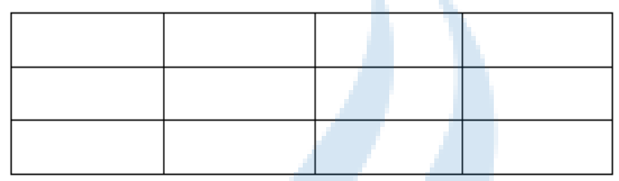

二维数组的内存：行数 * 列数 * 单个元素类型所占字节数 


#### 二维数组的初始化 

（1）给全部元素赋值： 

```c
int arr1[][4]={1,2,3,4,5,6,7,8,9,10,11,12};
//定义一个3行4列的二维数组，并给它的元素初始化赋值
int arr2[][4]={}; //全部赋值为0  并默认ROW=1
int arr3[][4]={0}; //全部赋值为0
```

（2）给每一行元素赋值： 

```c
int arr3[][4]={{1,2,3,4},
					 {1,2,3,4},
					 {1,2,3,4}}；
//初始化二维数组时，可以不指定数组的行数
```

（3）给部分元素赋值： 

```c
int arr[][3]={1,2};
//给数组前两个元素赋值，数组行数为1，此行最后一个元素默认为0
int arr[][3]={1,2,3,4};
//给数组前四个元素赋值，数组行数为2，第二行最后两个元素默认为0
int arr[][3]={{1,2},{3,4}};
//给数组每行的前两个元素赋值，数组行数为2，每行最后一个元素默认为0
```


#### 二维数组元素的访问

 基本格式：

 数组名 [行下标] [列下标]

​	注意：行下标的范围：0~行数-1，列下标范围：0~列数-1。并且，行下标、列下标可以是整型的常量、
变量、表达式。

```C
a[0][0]; //访问数组第1行第1个元素
a[1][0]; //访问数组第2行第1个元素
a[2][1]; //访问数组第3行2个元素
```

#### 二维数组的输入输出

```C
for(int i=0;i<3;i++)
for(int j=0;j<4;j++)
{//双重循环输入
	scanf(“%d”,&a[i][j]);
}

for(int i=0;i<3;i++)
for(int j=0;j<4;j++)
{//双重循环输出
	printf(“%d”,a[i][j]);
}
```

### 字符数组

​	字符数组简单的来说就是char类型的数组。

​	为什么要把字符数组分开讲呢？
​	字符数组是一类特殊的数组，由于C语言中没有字符串类型，所以字符串是存放在字符型数组中的。

#### 字符数组的定义及初始化

用来存放字符数据的数组就是字符数组。字符数组中的一个元素存放一个字符。
如：

```c
char c[6]={‘'a','b','c','d','e','f'}; //定义一个字符数组c，并以单个字符初始化赋值
char s[7]="abcdf"; //定义一个字符数组c，并以字符串初始化赋值
```

#### 使用字符数组中的元素

如：

```C
char s[10];	  //定义一个字符数组
s[0]='a';	 	//使用字符数组s的第一个元素s[0]并赋值
s[1]='b'; 		//使用字符数组s的第二个元素s[1]并赋值
```

#### 字符数组的输入和输出

如有定义以下字符数组：
方法一：以%c的格式循环输入输出

```C
for(int i=0;i<10;i++)
{
	scanf(“%c”,&s[i]);
} 
for(int i=0;i<10;i++)
{
	printf(“%c”,s[i]);
}
```

方法二：以%s的格式输入输出

```C
scanf("%s",s);  //输入字符串
printf("%s",s); //输出字符串
```

#### 二维字符数组

```C
char s3[][10]={"123456","abcdef","！@#￥%"}; //定义了一个二维字符数组，存储3个字符串
```

#### 常用的字符串处理函数

包含头文件 #include<string.h>

puts(字符数组); //输出字符串

gets(字符数组); //输入字符串

strlen(字符串); //测字符串长度函数，只计算有效字符，不包括’\0’

strcat(字符数组1,字符数组2); //字符串连接函数

strcpy(字符数组1,字符数组2); //字符串复制函数

strcmp(字符串1,字符串2); //字符串比较函数


### some homework

#### 1、统计数字出现次数

 从键盘输入若干个整数，其值在1至4范围内，用 -1作为输入结束的标志。统计每个整数的个数。
 如：
	 输入：1 1 2 3 3 3
	 输出：	
	   1出现2次
	   2出现1次
	   3出现3次
 	  4出现0次
 最好可以屏蔽违规输入

参考代码：

 [统计数字出现次数.c](参考代码\统计数字出现次数.c) 


#### 2、彩票系统

（1）.编程实现生成1~36范围内任意的7个数字
（2）.保证7个数字是不重复的。
（3）.输入一组号码与程序生成的随机号码对比，相同中奖，不同则反之

参考代码：

 [彩票系统.c](参考代码\彩票系统.c) 


## 函数

### 一、什么是函数？

​	所谓“函数”是从英文function翻译过来的，其意思既是“函数”，也是“功能”。从本质意义上来说明函数就是用来完成一定功能的，是把实现功能的代码封装起来，给这些封装起来的代码取个名字就是函数
名，每一个函数用来实现一个特定的功能，函数的名字对应其代表的功能。

​	为什么要使用函数呢？
​	函数就是为了提高代码的复用性，提高程序的可读性，在使用过程中比较灵活，更加方便了程序代码的
编写。

### 二、函数的定义

C语言要求，在程序中用到的所有函数，必须“先定义，后使用”。

定义函数应包括以下几个内容：
（1）指定函数的名字，以便后续按名调用。
（2）指定函数的类型，即函数返回值的类型。
（3）指定函数参数的名字、数据类型和个数，以便在调用函数时向它们传递数据。（无参函数不需要这
一项）
（4）指定函数所完成的功能，也就是规定函数要完成什么操作，说明函数是做什么的，这是最重要的一
点，函数的功能都是写在函数体中的。

#### 1、定义无参无返回值函数

类型名 函数名()
{
	函数体
} 

或：

类型名 函数名(void)
{
	函数体
}
在函数体里描述函数实现的功能。
如：

```c
void fun()
{
    printf("--------------------------------------------------\n");
}	//这里定义了一个函数，函数名为fun，无返回值，完成打印分隔线的功能。
```

#### 2、定义有参数无返回值函数

void 函数名(函数参数1,函数参数2,……)
{
	函数体
}
如：

```C
void max(int x,int y)
{ 
    int z;
	z=x>y?x:y;
	printf("%d\n",z);
} 	//求最大值函数，输出两个数之间的最大值
```

#### 3、定义有参数有返回值函数

类型名 函数名(函数参数1,函数参数2,……)
{
	函数体
	return （被定义的类型）;
}
如：

```c
int max(int x,int y)
{ 
	int z;
	z=x>y?x:y;	
	return z;
}//求最大值函数，返回两个数之间的最大值
```

#### 4、定义无参数有返回值函数

类型名 函数名()
{
	函数体
	return （被定义的类型） ;
}
void为空类型(函数在定义时不可不写返回类型，void表示啥都不返回，仅进行一堆骚操作)
如：

```C
int SCANF() //输入函数
{ 
	int temp;
	printf("请输入一个整型数据：\n");
	scanf("%d",&temp);
	return temp;
}
```

### 三、函数的调用

#### 1、函数调用语句

函数调用的基本格式：

​					函数名(实参列表);
如：

```c
int a=10,b=20,c;
c=max(a,b); //函数调用语句，调用max函数求a和b两个数中的最大值赋值给c
```


#### 2、函数参数

​	函数的参数分为实参和形参。

​	在调函数时，我们将调用其他函数的函数称为**主调函数**，将被调用的函数称为**被调函数**。在调用有参函
数时，主调函数和被调函数之间有数据传递关系。主调函数中将值传递出去的参数称为“实际参数”（简
称实参），被调函数中用于接收主调函数所传递过来值的参数称为“形式参数”或“虚拟参数”（简称形
参）。

#### 3、实参和形参之间的数据传递

在调用函数的过程中，系统会把实参的值传递给被调函数的形参，或者说形参从实参得到一个值。
函数调用过程中需要注意以下几点：
（1）实参可以是常量、变量或表达式。如：max(3,a+b);

（2）实参与形参的数据类型应相同或者赋值兼容，并且实参在实参列表中的位置与形参在形参列表中的
位置必须对应。

（3）函数遇到return返回语句返回过后，不再继续执行return之后的语句了。

（4）形参在其所在函数的调用期间有效，可以参加此函数中的运算，但是不能用于其他函数中。

（5）函数的形参和实参是两个不同的变量，所以，**一般情况下形参值的改变不影响实参的值，除非在函**
**数参数的传递类型为地址传递（这个具体会在后面指针部分学习）。**在未调用函数时，形参并不占用存储单元，开始函数调用时，才给形参开辟存储空间，函数调用结束后，形参的存储单元就会被释放。

#### 4、函数的返回值

​	函数可以通过返回值带回函数的运行结果，函数通过return语句带回返回值，应注意**返回值类型应与函**
**数类型一致**，即函数类型决定返回值的类型。

### 四、函数的声明

把函数的定义放在最后，主函数里能够调用么？其实是可以的。

在一个函数中调用另一个函数（即被调函数）需要具备以下条件：
（1）首先被调用函数必须是已经定义好的函数（库函数或自定义的函数）。
（2）如果使用库函数，应该在本文件开头用#include指令将调用相关库函数时所需用到的信息“包含”
到本文件中来。如：#include<stdio.h>。
（3）如果使用用户自定义的函数，在调用函数之前必须要有被调函数相关的声明语句，也就是**函数需要**
**先声明后使用**。

函数声明语句的一般格式：
		函数类型 函数名(参数类型1 参数名1,参数类型2 参数名2,……,参数类型n 参数名n);

### 五、数组作为函数参数传递

​	数组名为数组的首地址，所以整个数组作为函数参数传递实际上传递的是地址，形参的改变会影响到实
参。（涉及到指针的相关概念，这个在后面会具体学习）

如：字符串的输出

```c
void PUTS(char str[])
{
	puts(str);
}
int main
{
	char S[20]="hello world!";
	PUTS(S);
}
```

​	注意：在函数中改变形参数组元素的值，那实参数组元素的值是否会被改变呢？

​	

### 六、函数的嵌套调用

函数的定义是相互平行、独立的，在定义函数时，一个函数内不能再定义另一个函数，也就是说，函数
不能嵌套定义。但是函数可以嵌套调用，也就是再调用一个函数的过程中，又调用另一个函数。
如：main函数中调用输出函数

```c
#include <stdio.h>
int main()
{
	printf("Hello World!\n"); //在一个函数中可以调用另一个函数
	return 0;
}
```


### 七、函数的递归调用

思考：在一个函数中可以调用此函数本身吗？
答案：可以，这就是函数的递归调用。

在调用一个函数的过程中又出现直接或间接地调用此函数本身，称为函数的递归调用。

递归调用演示示例：

```c
//递归求1~n的和
int function(int n)
{ 
    if(0>=n) return n;	 //结束递归的条件
	return n + function(n-1);		 //这里在函数中调用此函数本身，实现递归
}
```

注意：递归的函数中应有结束递归的条件，否则会和死循环一样，陷入无限递归，或者说死递归。


例如：

​	使用递归法吗求阶乘（5！）

参考代码：

 [递归法求阶乘.c](参考代码\递归法求阶乘.c) 

### 八、局部变量和全局变量

按照变量作用域的不同，我们将变量分为局部变量和全局变量。

#### 1、局部变量

局部变量的作用范围只在一定范围内有效，超出了这个范围就会被自动销毁。
局部变量的定义可能有以下几种情况：
（1）在函数开头定义(作为函数形参)；
（2）在函数内部的复合语句中定义；
如：

```c
#include <stdio.h>
int main()
{
	int n = 10; //局部变量
	{
		int n = 100; //局部变量
		printf("%d\n",n); //输出结果为100
	} 
	printf("%d\n",n); //输出结果为10
	return 0;
}
```


#### 2、全局变量

​	全局变量的作用范围相对于局部变量来说更为广泛，其在函数外部定义，也称为外部变量。（实际上，这个东西在实际工作时能不用就不用。）
如：

```c
#include <stdio.h>
int n = 123; //全局变量：全局范围内有效
void fun()
{
	printf("%d\n",n); //输出结果为123
} 
int main()
{
	fun();
	printf("%d\n",n); //输出结果为123
	return 0;
}
```

​	在局部变量与全局变量的名字发生冲突时，优先使用局部变量，如：

```c
#include<stdio.h>
int a = 10;
int main()
{
	int a = 1;
	printf("%d\n", a);  //输出结果为 1
}
```


​	全局变量可以在该项目的任何一个文件中被使用，只需要在需要使用的文件中使用extern关键字进行声明就可以了。


全局变量不要瞎jb使用，比如说下面就是一个血淋淋的例子：

```C
void sub(int x, int y);
int x1 = 30, x2 = 40;
int main()
{
      int x3 = 10, x4 = 20;
      sub(x3, x4);
      sub(x2, x1);  //调用时，全局变量名与函数内部的x1、x2相冲，由于并没有在sub函数内定义，所以导致函数							  //sub直接对全局变量本身进行了操作,所以操作之后就成了x1=x2=40
      printf("%d,%d,%d,%d\n", x3, x4, x1, x2);
      return 0;
}
void sub(int x, int y)
{
      x1 = x;
      x = y;
      y = x1;
}
```


#### 3、静态变量与动态变量

​	程序中所定义的局部变量默认是动态存储的。
​	在定义变量前加一个static可定义一个静态变量。
​	静态变量在程序开始后定义，结束前才会被释放，所以其生命周期比较长，在函数调用中只会被定义一
次，不会被定义多次，当再次执行到定义语句时，其值不会被重置（初始化），会保留上次改变的值。（不过这个就不可以被extern到别的文件里了。）
如：

```c
#include <stdio.h>
void fun()
{
	static int n = 1; //静态变量：重复执行定义语句时，不会被重新定义和初始化
	printf("%d\n",n++);
} 
int main()
{
	for(int i=0;i<6;i++)
	fun();
	/*输出结果为:
	1 
	2
    3
    4
    5
    6
    */
	return 0;
}
```

（实际上，static还可以修饰全局变量、函数，static这个关键字以后会详细说明）


## 构造数据类型

​	构造数据类型就是根据自己的需要使用基本数据类型来进行构造的数据类型。

​	C语言中，构造数据类型主要有4种：数组、结构体、共用体（union，还有翻译成联合体的，我觉得翻译成够用提更好，毕竟这玩意儿本质是共用内存嘛。）、枚举类型（或者说，这东西应该被分到常量里也对，啊，不过无所谓了，都一样的。）

### 结构体

​	结构体就是用户根据自己的需要将一堆数据类型放到一块儿，形成一个类（都说C语言时面向过程的语言，但是你想让他面向对象编译器也没办法不是，最多就没有C++那么方便，仙人有亦有两般话，道不传虚只在人。），这个类形成后，C语言会把它当成一种新的数据类型。

​	但是，你就算是面型过程你也需要用到结构体，毕竟很多东西他使用结构体会方便一些，比如你要表示棋盘上某一点的状态（横坐标、纵坐标、棋子落子状态），而你要表示18*18个这样的数据，全分开写不现实，遇到类似的情景就得使用结构体了。

#### 结构体类型的定义与结构体变量的使用

​	结构体定义的一般形式：

```C
struct StructName
{
  parameter list  
};
```

​	其中，结构体名可省，但是你随后就无法声明该类型的对象（变量），你必须在定义的同时就声明变量，所以这种方式并不常用。

​	结构体变量的定义与使用：

```C
//若省略了结构体名，就只能在声明的同时定义变量
struct {
    int x;
    int y;
}A1,A2； //A1、A2就是该结构体的变量
    
//不省略结构体名，则可以在定义同时声明（方法跟上面一样），也可以在定义之后声明
struct human
{
    char name[20];
    int id;
};
struct human ymr={"ymr",666666}; //定义后声明
```

​	不过，这样定义的话，我们无法为无名结构体在定义后声明变量，为有名结构体声明变量时除了结构体名外还得加上个struct关键字，这就很麻烦，于是，我们还有一个定义的方法，就是使用typedef，这种在现实中更常用：

```C
typedef struct
{
	int X;
	int Y;
}coordinates; //给该数据类型重命名为coordinates，实际上这样更常用
coordinates A1,A2; //这样就可以给本无名的结构体创建变量了

typedef struct human
{
	char name[20];
	int id;
    coordinates A; //结构体成员可以是已知的任何数据类型的变量
}human;  
human ymr = { "ymr", 666666 };  //这样就不需要在定义变量时还得加上struct了
```

#### 结构体变量的初始化以及使用

​	在定义一个结构体之后，就可以对其已经声明的变量进行初始化，初始化的方式跟数组差不多，也是用{}操作符。比如上面的  human ymr = { "ymr", 666666 };

​	而建立一个结构体之后，我们往往需要对其成员进行访问，具体操作如下：

```c
typedef struct
{
	int X;
	int Y;
}coordinates;
coordinates A1,A2; 
A1.X=1; // 对于结构体变量的成员，咱们往往直接用 . 操作符进行访问(指针的话用 ->)
A2.Y=33;
```


还有一件事~

​	数组本质上是C语言自带的可定义的存储结构，所以对于任何已知的数据结构都可以定义数组，结构体当然也可以定义数组。就比如要描述一下开头时说的：描述一个18*18的棋盘的每一点的状态：

```C
typedef struct
{
	int X;
	int Y;
	int board_state;
}cheesboard;

cheesboard board[18 * 18];  // 声明18*18个这种结构体变量
```


#### 结构体的内存大小

​	结构体既然把各种数据类型捏合到了一块儿，那么作为一种新的数据类型，他就应该要有一个大小。

​	结构体是按照成员中最大字节的基本数据类型来进行对齐的。比如对于：

```c
typedef struct
{
	long long id;
    int age;
    char name[10];
}girlfriends;
printf("%d",sizeof(girlfriends));
```

​	运行结果为24，说明该结构体的大小是 24 byte。其内存分配如下图所示：

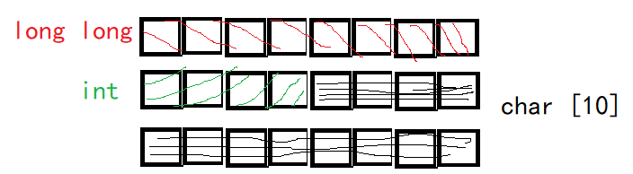

​	而这样的对齐是必须的，因为计算机在读取内存的时候是要求对齐的，计算机为了保证读取效率，所以不会单独读取某个内存空间，所以为了防止计算机读取时精神错乱，所以就发明了这种对齐机制。（了解就好）

​	对于内存对齐，摘录一位老哥的博客如下：

1、默认状态下

（1）分配内存的顺序是按照声明的顺序来执行的（而非初始化列表的顺序）；

（2）每个变量相对于起始位置的偏移量需要时自己大小的整数倍，如果不是的话，就要填补内存，直至偏移量为整数倍为止；

（3）结构体或者类分配完了内存之后，需要将内存对齐到最大变量大小的整数倍；

（4）对于一个空类，其被继承的时候大小为0，但是不被继承的时候，其单独大小为1。

2、添加了#pragma pack(n)之后，规则会发生改变

（1）偏移量需要时n和变量自身大小中较小的整数倍

（2）整体的大小要是n和最大变量大小中较小的整数倍

（3）n需要时2^k（k从0到任意），如果为其他值就执行默认分配。
————————————————
版权声明：本文为CSDN博主「yanzhe1」的原创文章，遵循CC 4.0 BY-SA版权协议，转载请附上原文出处链接及本声明。
原文链接：https://blog.csdn.net/yanzhe1/article/details/125961138

### 共用体

这玩意儿在软件开发、游戏开发里用的比较少，在嵌入式开发里倒是用的比较多，因为内存有限。

​	当你和你的好兄弟一起住酒店的时候，定完房间发现只有一张床，但是你们俩表示：男男授受不亲，两个大老爷们儿一张床，这成何体统？于是，你们俩决定，你前半夜睡，他后半夜睡，而这就形成了你们之间的共用体——你们俩共用一张床！而在C语言中，共用体当然不是不是共用一个老婆，啊，不是，是共用一张床了，而是共用一段内存。这意味着共用体还会进行内存对齐，还是以最大的那个对齐，比如：

```c
union DATA
{
    int a;
	double b;
	char c[10];
}d1,d2,d3;
printf(“%d\n”,sizeof(d1));
```

运行结果 16

对齐方式如下图所示：

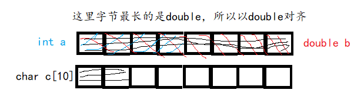

#### 共用体的定义与使用

​	共用体的定义、使用和结构体一样，顺道一提，共用体也可以typedef和声明无名共用体。

举个栗子：

```c
//分析以下程序的输出结果
void main()
{
     union
     {
          int n[2];
          int x;
      } S;

     S.x = 10;
     S.n[0] = 20;
     S.n[1] = 30;
     printf("%d\n", S.x );
}
```

答案是20，因为S.x与S.n[0]共用一段内存（这说明在vs2013中共用体的储存是采用小端模式的）。


### 枚举类型

#### 枚举类型的概念

​	如果一个变量只有几种可能的值，就可以定义为枚举类型，所谓的“枚举”就是指吧可能的值一一列举出来，枚举变量的取值范围只限于列举出来的值的范围内，也就是只能在值的集合内选择。
​	枚举类型相当于是取值范围受限的整型，其是按照整型的方式进行处理的。

#### 枚举类型的声明

枚举类型关键字：enum
enum 类型名{枚举元素列表};
例如：

```c
enum Weekday
{	
    sun,    //0
 	mon,  //1
 	tue,    //2
 	wed,   //3
 	thu,    //4
 	fri,      //5
 	sat     //6
};
//以上声明了一个枚举类型的变量Weekday，用于表示星期，其变量的取值范围为星期天至星期六。
```

#### 枚举变量的定义

​	根据以上声明我们可以定义此枚举类型的变量。
例如：
union 共用体名
{

 成员列表;
}变量列表;

​	如：

```C
//接上述代码
enum Weekday workday,weekend;
//这里在声明后定义了两个enum Weekday枚举类型的变量workday和weekend
```

​	声明的枚举类型也可以没有类型名，但如果需要使用此枚举类型的话，就必须在声明时同时定义变量。
如：  

```c
enum {sun,mon,tue,wed,thu,fri,sat} workday,weekend;
```

#### 枚举类型的使用

（1）在C语言中枚举类型的枚举元素是按照常量进行处理的，所以又称为枚举常量。不要因为它们是标
识符而把它们当作变量来使用，在使用时是不能对它们赋值的。
例如：

```c
sun=0; mon=1; sun = 7; //错误，不能给枚举常量赋值，所有的常量都不能进行赋值操作
```

（2）每一个枚举元素都代表一个整数，C语言编译器按照定义时的顺序默认它们的值为0，1，2，3，
4，5，6……。在上面的声明中，sun的值为0，mon的值为1，tue的值为2，依次类推。
如果有赋值语句：
	枚举常量的引用和输出：
如：

```c
workday=mon;
//就相当于：workday=1;
```

​	枚举变量的引用和输出：
如：

```c
printf(“%d”,sun); //输出整数0
```


（3）我们也可以人为的指定枚举元素的数值，在声明的枚举类型的时候显式指定。
例如：

```c
workday=mon;
printf(“%d”,workday);  //输出整数1
```

指定枚举常量sun的值为7，mon的值为1，之后的值顺序加1，也就是tue的值为2，sat的值为6。
由于枚举类型的值为整数，因此C99把枚举类型也作为整型数据的一种，即用户自己定义的整数类型。

（4）枚举类型可以用来比较和判断。

```c
if(workday==mon) {……}
if(workday<=sat) {……}
```

​	枚举类型的比较规则是按照其初始化时指定的整数大小来进行比较的。如果声明时没有人为指定，就按默认规则处理，即第一个枚举元素的值为0，第二个枚举元素的值为1，依次类推，所以mon>sun,sat>fri  

### some homework

​	1、用结构体存储矩形相关信息，使用函数求矩形的周长和面积。

参考代码：

 [求矩形面积.c](参考代码\求矩形面积.c) 


​	2、从键盘输入一个点和一个圆，判断点和圆的位置关系。（点由x，y坐标确定；圆由圆心和半径确定）

参考代码：

 [判断点是否在圆内.c](参考代码\判断点是否在圆内.c) 


​	3、

编写程序，实现以下功能：

​	猜拳小游戏：石头剪刀布

​	游戏规则：石头克制剪刀，剪刀克制布，布克制石头。

​	编写玩游戏函数，实现玩家和电脑对战。

​	电脑随机出拳（运用随机函数srand()、rand()和time(NULL)产生随机数，需要包含头文件stdlib.h和time.h）；

​	玩家输入“石头/剪刀/布”进行出拳（需要定义石头剪刀布的枚举类型来记录）；

​	玩家和电脑可以循环多次猜拳，判断猜拳的结果，如果玩家赢了则输出“玩家赢了”，如果玩家输了则输出“玩家输了”，如果是平局则输出“平局”。 

参考代码：

 [石头剪刀布.c](参考代码\石头剪刀布.c) 


## 预处理与文件操作

​	在开篇处就提到过编译，就是把源码转成计算机可识别的二进制文件（.obj）的过程，这个过程就相当于煮大米饭时把米扔到锅里一样，大米就是源码，但是大米不经过处理（淘米、泡米、加水）而直接扔到电饭锅里是不好吃的，同理，源码也不能直接扔到编译器里，它需要经过预处理才能变成香喷喷的大米饭，啊，不是，是链接程序！

​	而进行什么样的预处理也是在源码中就已经被说明的，就是那一堆以 # 开头的代码，这些将告诉VS要如何进行预处理（这也是高级语言的特性，对人比较友好），比如 #include<stdio.h> 就是将系统头文件stdio.h 复制粘贴到这里的意思。


​	先说一个不成文的规矩：宏一般都用大写来表示，以防和函数混淆，便于人来分辨。


| `#define`  | 定义宏                                                       |
| ---------- | ------------------------------------------------------------ |
| `#include` | 包含一个源代码文件                                           |
| `#undef`   | 取消已定义的宏                                               |
| `#ifdef`   | 如果宏已经定义，则返回真                                     |
| `#ifndef`  | 如果宏没有定义，则返回真                                     |
| `#if`      | 如果给定条件为真，则编译下面代码                             |
| `#else`    | `#if` 的替代方案                                             |
| `#elif`    | 如果 `#if` 条件为假，当前条件为`真`                          |
| `#endif`   | 结束一个 `#if……#else` 条件编译块                             |
| `#error`   | 当遇到标准错误时，输出错误消息                               |
| `#pragma`  | 使用标准化方法，向编译器发布特殊的命令到编译器中，不过这个是VS特有，其他编译器可能不识别。（其他编译器可能也支持） |

```c
// 所有的 MAX_ARRAY_LENGTH 替换为 20
#define MAX_ARRAY_LENGTH 20
// 系统库中获取 stdio.h
#include <stdio.h>
// 本地目录中获取 myheader.h
#include "myheader.h"
#undef  FILE_SIZE // 定义宏常量
#define FILE_SIZE 42 // 取消已定义并定义为 42
```

### 预定义宏

| `__DATE__` | 当前日期，一个以 "MMM DD YYYY" 格式表示的字符常量 |
| ---------- | ------------------------------------------------- |
| `__TIME__` | 当前时间，一个以 "HH:MM:SS" 格式表示的字符常量    |
| `__FILE__` | 这会包含当前文件名，一个字符串常量                |
| `__LINE__` | 这会包含当前行号，一个十进制常量                  |
| `__STDC__` | 当编译器以 `ANSI` 标准编译时，则定义为 `1`        |

`ANSI C` 定义了许多宏，您可以使用这些宏，但是不能直接修改这些预定义的宏

预定义宏示例

```c
#include <stdio.h>

int main() {
  printf("File :%s\n", __FILE__);
  printf("Date :%s\n", __DATE__);
  printf("Time :%s\n", __TIME__);
  printf("Line :%d\n", __LINE__);
  printf("ANSI :%d\n", __STDC__);
}
```

### 宏延续运算符（\）

一个宏通常写在一个单行上。

```c
#define  message_for(a, b)  \
    printf(#a " 和 " #b ": 我们爱你！\n")
```

如果宏太长，一个单行容纳不下，则使用宏延续运算符 `\`

### 字符串 常量化 运算符（#）

```c
#include <stdio.h>

#define  message_for(a, b)  \
  printf(#a " 和 " #b ": 我们爱你！\n")

int main(void) {
  message_for(Carole, Debra);
  return 0;
}
```

当上面的代码被编译和执行时，它会产生下列结果：

```
Carole 和 Debra: 我们爱你！
```

需要把一个宏的参数转换为字符串常量时，使用字符串常量化运算符 `#`

### 标记粘贴运算符（##）

```c
#include <stdio.h>

#define tokenpaster(n) printf ("token" #n " = %d", token##n)

int main(void){
  int token34 = 40;
  tokenpaster(34);
  return 0;
}

结果：
    token34 = 40
```

### defined() 运算符

```c
#include <stdio.h>

#if !defined (MESSAGE)
   #define MESSAGE "You wish!"
#endif

int main(void) {
  printf("Here is the message: %s\n", MESSAGE);  
  return 0;
}
```

​	要知道一件事：#define的本质是进行文本的替换，所以使用这东西的时候一定要小心，要确保内容替换后符合C语言的语法规则。

### 参数化的宏

```c
int square(int x) {
   return x * x;
}
```

宏重写上面的代码，如下：

```c
#define square(x) ((x) * (x))
```

宏名称和左圆括号之间不允许有空格

```c
#include <stdio.h>
#define MAX(x,y) ((x) > (y) ? (x) : (y))
int main(void) {
   printf("Max between 20 and 10 is %d\n", MAX(10, 20));  
   return 0;
}
```

```c
//  使用代参宏的时候要养成好习惯，把所有参数用（）包起来，防止它出现精神错乱
//  比如：
#define MUL1(x,y) x*y
#define MUL2(x,y) (x)*(y)
// 这两个东西看起来差不多，但是实际上是不一样的
int main()
{
    printf("%d\n",MUL1(1+1,2+2));  // 结果是1+1*2+2  =  5
    printf("%d\n",MUL2(1+1,2+2));  // 结果是（1+1）*（2+2） = 8
}
```

​	但是带参宏和函数不同，函数的本质是去调用代码，所以实际上会降低代码的执行效率，但是带参宏还是对代码进行替换，所以相对于来调用函数，这样实际上是增加了代码的执行效率。


### 文件的概念

#### 什么是文件

​	内存中存放的数据在计算机关机后就会消失。要长久保存数据，就要使用硬盘、光盘、U 盘等设备。为了便于数据的管理和检索，引入了“文件”的概念。究其本质是存储在某种长期储存设备或临时存储设备中的一段数据流，并且归属于计算机文件系统管理之下。

​	目前我们接触到的文件主要有两种：

​		（1）程序文件。包括源程序文件（后缀名为.c）、目标文件（后缀名为.obj）、可执行文件（后缀名为.exe）等。这一类型的文件主要用于存储程序代码。

​		  (2）数据文件。此文件的内容不是程序，而是程序运行时读写的数据，比如程序运行过程中输出到磁盘或其他设备上的数据，或在程序运行过程中供程序读取的数据。  


#### 文件的概念

##### （1）文件名

​	就跟我们在定义变量时，变量要有名字，同理，文件也要有名字。文件名由三部分组成：①文件路径：表示文件在外存设备中的存储位置； ②文件名主干：表示文件的名字，可由用户自定义，命名规则应遵循标识符的命名规则。 ③文件后缀：表示文件的性质，也称为文件的格式，用于描述文件的类型（如txt、ppt等）。
​	文件路径能唯一标识文件在外存中的位置。 如：D:\C++\VSproject\TEXT\text.c  

##### （2）文件的存储形式

​	文件虽然在存储器中都是以二进制的形式出现的，但是其组织形式不同，所以文件就分成了ASCII文件和二进制文件  。

​	数据在内存中是以二进制形式存储的，如果不加转换的输出到外存，就是二进制文件，可以认为它是存储在内存的数据的映像，所以称之为映像文件。如果要求在外存上以ASCII码形式存储，就需要在存储前进行转换。ASCII文件又称为文本文件，每一个字节存放一个字符的ACSII码。  

​	一个数据在磁盘上存储，字符一律以ASCII形式存储，数值型既可以用ASCII形式存储也可以用二进制形式存储。如整数10000，用ASCII码形式存储在磁盘上占5个字节（每个字符占一个字节），而用二进制形式存储在磁盘上只占4个字节（00000000 00000000 00100111 00010000）。用ASCII形式存储时字符与字节一一对应，一个字节代表一个字符，便于逐个处理，但占的存储空间较多，而且处理的时候要花费转换时间（二进制与ASCII码之间的转换）。二进制形式存储就相当于直接把内存中的内容原封不动存储在磁盘上，由于不需要转换，所以二进制文件更加方便计算机处理。  


### 文件操作

​	之前我们学的printf（）、scanf（）函数进行输入输出都是面向终端的，而要面向文件就得使用文件操作了。

​	C语言要如何实现对文件的操作呢？

​	其实就四步：

​		1、定义指向该文件的指针

​		2、打开文件

​		3、对文件进行操作

​		4、关闭文件（让指针不再指向该文件

#### 文件指针的定义

​	由于文件类型已经在stdio.h头文件中有声明了，所以我们不需要另外声明，直接使用就行了。 文件类型变量的定义格式为：FILE 文件变量名; 如：

```C
FILE f1;
```

​	定义一个结构体变量f1，用它来存放一个文件的相关信息。这些信息是在打开文件时由系统根据文件的情况自动放入的，用户不必过问。 我们一般不会用文件变量来访问文件，而使用文件指针来访问文件。文件指针的定义格式为：FILE *文件指针名;
如：

```c
FILE* fp;
```

​	定义一个指针fp用于指向FILE类型的数据，可以使fp指向某一个文件在内存中的文件信息区（结构体变量），通过此文件信息区能够访问此文件。也就是说通过文件指针变量能够找到并可以操作其指向的文件。）


#### 文件处理函数

| `fopen()`   | `打开`新文件或现有文件     |
| ----------- | -------------------------- |
| `fprintf()` | 将数据`写入`文件           |
| `fscanf()`  | 从文件中`读取`数据         |
| `fputc()`   | 将一个字符`写入`文件       |
| `fgetc()`   | 从文件中`读取`一个字符     |
| `fclose()`  | `关闭`文件                 |
| `fseek()`   | 将文件指针设置到`给定位置` |
| `fputw()`   | 将整数`写入`文件           |
| `fgetw()`   | 从文件中`读取`一个整数     |
| `ftell()`   | 返回当前`位置`             |
| `rewind()`  | 将文件指针设置为文件的开头 |

C 库中有许多函数可以`打开`/`读取`/`写入`/`搜索`和`关闭`文件

##### 打开文件：fopen()

```c
#include<stdio.h>

void main( ) {
  FILE *fp;
  char ch;
  fp = fopen("file_handle.c", "r");

  while (1) {
    ch = fgetc(fp);
    if (ch == EOF)
    break;
    printf("%c", ch);
  }
  fclose(fp);
}
```

对文件执行所有操作后，必须关闭 `fclose()` 该文件


打开模式参数：

> | `r`   | 以`读取`模式打开一个文本文件，允许读取文件                   |
> | ----- | ------------------------------------------------------------ |
> | `w`   | 以`写`模式打开一个文本文件，允许写入文件                     |
> | `a`   | 以`追加`模式打开一个文本文件 如果文件不存在，则会创建一个新文件 |
> | `r+`  | 以`读写`模式打开一个文本文件，允许读写文件                   |
> | `w+`  | 以`读写`模式打开一个文本文件，允许读写文件                   |
> | `a+`  | 以`读写`模式打开一个文本文件，允许读写文件                   |
> | `rb`  | 以`读取`模式打开二进制文件                                   |
> | `wb`  | 以`写入`模式打开二进制文件                                   |
> | `ab`  | 以`追加`模式打开二进制文件                                   |
> | `rb+` | 以`读写`模式打开二进制文件                                   |
> | `wb+` | 以`读写`模式打开二进制文件                                   |
> | `ab+` | 以`读写`模式打开二进制文件                                   |

##### 写入文件：fprintf()

```c
#include <stdio.h>

main() {
  FILE *fp;
  fp = fopen("file.txt", "w"); // 打开文件
  // 将数据写入文件
  fprintf(fp, "fprintf 的 Hello 文件..\n");
  fclose(fp); // 关闭文件  
}  
```

##### 读取文件：fscanf()

```c
#include <stdio.h>  
main(){
  FILE *fp;
  char buff[255]; // 创建char数组存储文件数据
  fp = fopen("file.txt", "r");
  while(fscanf(fp, "%s", buff)!=EOF) {
    printf("%s ", buff);
  }
  fclose(fp);
}
```

##### 写入文件：fputc()

```c
#include <stdio.h>

main(){
  FILE *fp;
  fp = fopen("file1.txt", "w"); // 打开文件
  fputc('a',fp); // 将单个字符写入文件
  fclose(fp);    // 关闭文件
}
```

##### 读取文件：fgetc()

```c
#include<stdio.h>
#include<conio.h>
void main() {
  FILE *fp;
  char c;
  clrscr();
  fp=fopen("myfile.txt", "r");
  while((c=fgetc(fp))!=EOF){
    printf("%c", c);
  }
  fclose(fp);
  getch();
}
```

##### 写入文件：fputs()

```c
#include<stdio.h>
#include<conio.h>

void main(){
  FILE *fp;
  clrscr();
  fp = fopen("myfile2.txt","w");
  fputs("hello c programming",fp);
  fclose(fp);
  getch();
}
```

##### 读取文件：fgets()

```c
#include<stdio.h>
#include<conio.h>

void main() {
  FILE *fp;
  char text[300];
  clrscr();

  fp=fopen("myfile2.txt", "r");
  printf("%s", fgets(text, 200, fp));
  fclose(fp);
  getch();
}
```

##### fseek()

```c
#include <stdio.h>
void main(){
  FILE *fp;
  fp = fopen("myfile.txt","w+");
  fputs("This is Book", fp);

  // 将文件指针设置到给定位置
  fseek(fp, 7, SEEK_SET);
  fputs("Kenny Wong", fp);
  fclose(fp);
}
```

将文件指针设置到给定位置

##### rewind()

```c
#include<stdio.h>
#include<conio.h>
void main(){
  FILE *fp;
  char c;
  clrscr();
  fp=fopen("file.txt", "r");
  while((c=fgetc(fp)) != EOF){
    printf("%c", c);
  }
  rewind(fp); // 将文件指针移动到文件的开头
  while((c=fgetc(fp)) != EOF){
    printf("%c", c);
  }
  fclose(fp);
  getch();
}
// 输出
// Hello World!Hello World!
```

##### ftell()

```c
#include <stdio.h>
#include <conio.h>

void main (){
   FILE *fp;
   int length;
   clrscr();
   fp = fopen("file.txt", "r");
   fseek(fp, 0, SEEK_END);

   length = ftell(fp); // 返回当前位置

   fclose(fp);
   printf("文件大小: %d bytes", length);
   getch();
}
// 输出
// 文件大小: 18 bytes
```


具体可见代码：
		 [文件操作.c](参考代码\文件操作.c) 


### Some  Homework

如有以下定义：

​	char str[20]=“Hello World!”;

​	将此字符串存入文件”test1.txt”中，然后逆序从此文件中读取出来

​	并逆序输出。程序完成后输出结果为!dlroW olleH


参考代码：

​		 [文件读写.c](参考代码\文件读写\文件读写\文件读写.c) 


## C语言的灵魂——指针  

​	指针在C语言中有多重要，看标题就知道。C语言可以靠指针来直接对内存进行操作，可以说，C语言很多牛B的功能都是靠着指针来实现的。不懂指针就相当于没学过C语言。

​	那么指针是什么呢？

​	指针其实就是内存单元的地址。而指针之所以叫指针而不是叫地址，这是因为叫指针更能突出其用法，这个很快在下文就会提到。

### 内存与内存地址

​	正如要孩子需要有老婆一样，学指针就需要知道内存这个概念。

​	内存就是直接跟CPU连着的那个存储器，而为了方便CPU进行访问，我们把内存划分成了一个个的存储单元，每个单元大小为1 byte==8 bit 。

​	这就好像你去酒店开房，你一进酒店，就发现有一个个的房间，这个房间就是内存的存储单元，每个房间都有门牌号吧？这个门牌号就是这个房间的地址；那么同理，内存单元也有其地址。操作系统将每个内存单元都编了个序号，这就是内存单元的地址了。

​	在酒店里，我们拿到房卡就知道我们要住到哪个房间了，因为房卡上有房间的地址，比如说我拿到的是405的房卡，这里我们就可以说这张房卡指向405房间。同理，我们知道内存的编号之后，我们就可以说这串编号指向该内存单元。指针，望文生义就是指向并针对你进行操作。我们可以拿到房卡之后走到房间门口，刷卡进入，对房间进行操作；那么我们知道内存单元的地址之后我们就可以针对内存单元进行操作，这就是指针，可以说酒店房间的指针是房卡，那么c语言的指针就是内存单元的地址。


### 指针变量

​	与其他的变量一样，我们要想使用指针，就得有存放指针的变量。而C语言还恰好提供了指针变量的数据类型。声明方式为：
​				基类型名* 指针变量名；

例如：

```c
int* aaa;
double* bbb;
long long* ccc;


// 一些不寻常的指针，暂时看看了解知道就好
typedef struct{
    int a;
    char b[20];
}abc,*pabc; //后者直接定义了结构体abc的指针数据类型为pabc，在后面直接用就行
pabc A;

int add(int x,int y)
{
    return x+y;
}

int (*fun)(int,int); //函数指针
fun=add; //函数名直接代表其首地址

// 除此以外，还有数组指针、指针数组……这些会在后面细说
```


​	其实还有一个问题：指针变量的类型那么多，那么他们的大小是多少呢？

​	其实他们是一样大的，因为他们只需要存储内存单元的地址就好了，而在一个平台下，会将内存地址的大小一视同仁。在32位的环境下，那就是4 byte  ；在64位的环境下，那就是 8 byte 。

​	这其实是与计算机的构造有关系：CPU如果想访问到某个具体的内存单元，就要先知道那个内存单元的地址，那CPU是怎么找到内存单元的呢？这是通过与内存相连的地址总线来实现的（这是物理意义上存在的导线），每一根线通电为1，不通电为0，32根地址总线就需要32个 bit 位来存储，即4 byte；64根地址总线就得 64 个 bit 位，即8 byte 。现在的电脑基本上都是64位的，也可以兼容32位的环境，这个可以在编译器中进行设置。


### 指针变量的赋值与解引用操作

​	指针变量是用来存放某个数据的地址的，那怎么来对他进行赋值呢？这个其实使用 & 操作符就好了。很多同志可能会感到疑惑，这不是按位与操作符吗？怎么就变成用来取地址的操作符了？这个很好理解，就好像咱们平常说话的时候，一句“方便吗？”起码有六种意思，汉语和C语言都是语言，有这种现象便也不足为奇了（用术语来讲，这叫操作符的重载。）

例如：

```c
int a ;
int* pa=&a;

// 其实也可以直接给它赋常量值，比如：
int* pa=123;
// 但是除非特别需要，否则我们不会这么干，因为这样这个指针将会直接指向内存，
// 若此处为系统文件，通过指针进行修改后可能会导致整个操作系统报废
// （尽管在vs2022的保护下，这种情况不会发生，最多vs2022崩了，但在实际工程问题中就不一定了）

// 若指针刚被定义的时候不知道要指向哪里，在初始化的时候一定要记得将其置空以保护数据
int* pa=NULL;
```

​	那么如何通过指针来修改被指向的内存呢？这就需要指针的解引用操作了。指针变量获取内存地址，相当于拿到了指向该房间的房卡，解引用就相当于刷卡进入房间。解引用操作符 * 

```C
int a =10;
int* pa=&a;
*pa = 20;
printf("%d\n",a);
// 结果是20
```

### 指针运算

```C
// 冷知识：C语言中数组名即为数组首元素地址
// 由此可以说一下指针的运算：
int arr[10]={1,2,3,4,5,6,7,8,9,10};
// 而此时我们想在控制台上输出这个数组的所有元素，于是我们使用了一个for循环
for (int i=0;i<10;i++)
{
    printf("%d\t",arr[i]);
}
printf("\n");

//除此以外还有一种方法，不过还是for循环
for(int i=0;i<10;i++)
{
    	printf("%d\t",*(arr+i));
}
printf("\n");

//上述两种方法输出的结果是一样的

// 不过在这里可能就有一些同志要问了，arr是数组首元素地址，首元素地址+1后一个指向的是下一内存单元的地址
//  而int型在此占4字节那，那在for循环中应该写成i+=4呀！这就是在声明指针变量的时候要声明基类型的原因：
//  在解引用前，地址+1不再是纯粹的跳过一个内存单元，而是跳过一个数据元素的内存单元数


// 指针间的减法运算 :
// 指向同一组类型相同数据的指针之间可以进行减法运算 , 相减的结果表示两指针间相距的数据的个数 .
    int arr[10] = { 1,2,3,4,5,6,7,8,9,10 };
    printf("%d\n", (&arr[0] - &arr[6]));  //结果 -6

// 指针的关系运算 ：
// p , q 指向同一个数组 , p > q 表示p 是否指向 q 所指位置的后面 , 若成立则表达式的值为真 , 否则为假（0） .
    int arr[10] = { 1,2,3,4,5,6,7,8,9,10 };
    printf("%d\n", (&arr[0] > &arr[6]));  // 0
    printf("%d\n", (&arr[0] < &arr[6]));  // 1

//指针的下标运算 ：
//  p[i]   等价于   *(p + i) ;
```

### 指针函数和函数指针

```C
// 指针
// 函数
// 指针函数
// 函数指针
// 指向指针函数的函数指针
// 指向指向指针函数的函数指针的函数指针
// 返回值为指向指向指针函数的函数指针的函数指针的指针函数 /doge

//  当然了，后三个在实际生产中是不用的，就是我自己闲的没事干瞎写的奥！

// 指针函数 还是函数，但是返回值是个指针
//比如说：
int* fun()
{
	int a=10086;
	return &a;           // 当然了，这是一种错误的写法，尽管编译器不会报错。
}                              // 若返回局部变量的地址，在调用前，这个地址就被释放了，你调用了个寂寞

int main()
{
	int* a = fun();
	printf("%d\n", *a);  // 在vs2022中结果为 10086 正常来讲应该是乱码，这纯粹是因为vs2022比较牛B，帮你
                                  // 优化了一下
	
    printf("%d\n", *a);  // 乱码
}


// 函数指针            温馨提示，函数的标识符即是其首地址
// 这是个指针，具体来讲这是个指向函数的指针
// 比如:
int add(int x, int y)
{
	return x + y;
}

int (*pfun)(int, int);

int main()
{
	pfun = add;
	printf("%d\n", (*pfun)(1, 2));
}

// 值得一提的是，可以对函数指针使用typedef，但是不需要取别名，其别名就是其本身。
// 在typedef之前,上述的pfun只能是一个函数指针变量，但是经过typedef之后就成了一种数据类型，
// 而从此我们就可以声明该函数指针类型的变量了
int add(int x, int y)
{
	return x + y;
}

 typedef int (*pfun)(int, int);

int main()
{
	pfun padd = add;
	printf("%d\n", (*padd)(1, 2));
}


// 那就有小伙伴要问了，我们直接整个函数不就完了？为什么要整个这么复杂的东西？
// 这就跟函数指针的工程应用有关系了：
// 通常来讲，一个项目往往不是由一个人来完成的，往往是由多个人来完成，然后交给主程序员来对功能进行整合

// 比如说，写一个计算器程序， 程序员A负责实现加法和减法的功能，代码如下：
int add(int x, int y)
{
	return x + y;
}

int sub(int x, int y)
{
	return x - y;
}

// 但是程序员A树懒转世，干活贼稽巴慢，说了明天交，结果后天才交上去的
// 与此同时，主程序员MAIN干活却唰唰的，急性子，同时他也知道自己搭档啥德行，
// 于是在A上交代码前就已经写好了代码 :
typedef int (*pfun)(int, int);

void fun(pfun fun, int x, int y)
{
	printf("%d\n", (*fun)(x, y));
}

int main()
{
	//调用加法
	fun(add, 1, 2);
	//调用减法
	fun(sub, 3, 1);
}

```

### 常量指针与指针常量

```C
// 首先不杠奥，这里的常量是指被const修饰的常变量

// 常量指针
// 常量指针就是指向常量的指针，可以改变指针变量内保存的地址常量，
// 但是对于解引用后内存中的内容不可改变,不需要初始化
// 比如：
const int* p;


// 指针常量
// 就是作为常量而出现的指针，定义时必须初始化
// 可以改变指向的内存单元中的内容，但是不能改变指针变量内保存的内容
int a;
int* const pa=&a;

// 这两者用于保护函数调用时保护实参，防止被莫名其妙的修改从而出现bug


一句话：const修饰的是他右边的东西，而被const修饰的变量时不可以被再次赋值的（相当于变成了常量，但是编译器本质上还会认为他是个变量，所以被const修饰的东西经常被称之为被const修饰的常变量）。
    
    比如说：
    
    int const *pa；  // *pa 是常量，pa是变量
    const int *pb；  // *pb 是常量，pb是变量 
    int* const pc;     // *pc  是变量，pc 是常量，pc无法被再次赋值，因此pc必须在声明时被初始化、
```


### 指针数组与数组指针

```C
// 指针数组
// 之前好像讲过，任何数据类型在C语言中都可以申请数组。
// 数组的本质就是将同一数据类型的东西在内存中进行连续存储。
// 而指针数组就是用于存放指针类型的数组
// 比如说：
int arr[3][3]
int (*parr)[3]=arr ;  //定义了一个指向3列数组的数组指针(用于指向二维数组)


// 数组指针
// 是一个指针，用于指向一个数组（通常是一个二维数组或者更高维的数组）
// 比如说：
int a,b,c;
int*pa=&a;
int*pb=&b;
int*pc=&c
int* parr1[3]={pa,pb,pc};  // 定义了一个存有整形指针的3列的数组


// 使用的一个案例，看明白了差不多就懂了
int n[3][4]=
{
    {1,2,3,4},
    {5,6,7,8},
    {9,10,11,12}
};
int(*pn)[4]=n;
int* p[3]={n[1],n[0],n[2]};        // n[0] 就是指n[3][4]中第一行的一维数组
int* *pp=p;
printf("%d\n",*(*(pp+1)+2));  // 3
printf("%d\n",*((pp[2])-3));    // 6


// 还有就是可以使用指针数组来输出字符串
    char* str[] =
    {
        (char*)"道可道，非常道",
        (char*)"学而不思则罔，思而不学则殆",  // 这么写是因为vs2022中不允许使用const char*类型来初始化char*
        (char*)"漂亮姐姐YYDS！！！"              // 型数组
    };
    for (int i = 0; i < (sizeof(str) / sizeof(str[0])); i++)
    {
        printf("%s\n", str[i]);
    }
```


### 内存四区(初步认识)

#### 栈区

由编译器自动分配释放，存放函数的参数值，局部变量等。

#### 代码区

存放函数体的二进制代码，由操作系统进行管理。

#### 静态区(静态全局区)

存放全局变量和静态变量以及常量。

#### 堆区

由程序员分配和释放，若程序员不释放，程序结束时由系统回收。


### 结构体指针

```C
// 结构体指针，就是指向结构体的指针，这种指针变量中存的是该结构体变量的首地址
// 声明方法：
// 普通方法
struct Abc
{
    int a;
    char name[20];
};

struct Abc abc;
struct Abc *pabc=&abc;
// 很显然。这种方法很麻烦，所以我们可以使用typedef
// 在声明结构体的数据类型的同时就把此结构体的数据类型顺道也声明了

typedef struct{
    int a;
    char namr[20];
}Abc,*pabc;  // 自此，Abc就是该结构体的数据类型名，pabc为该结构体的指针的数据类型名


// 还有一件事，就是使用结构体数组
typedef struct {
	int id;
	char name[20];
}Abc,*pabc;

int main()
{
	//定义一个结构体数组
	Abc n[5] = {
		{123,"aaa"},
		{234,"bbb"},
		{345,"ccc"},
		{456,"ddd"},
		{567,"eee"} };
	
	pabc p = n;
	printf("%d  %s\n", (p + 1)->id, (p + 1)->name);  // 234  bbb
	printf("%d  %s\n", p[2].id,p[2].name);           // 345  ccc
	p++;
	printf("%d  %s\n", (p + 1)->id, (p + 1)->name);  // 345  ccc
}
```

### 动态内存分配

```C
// 很多时候，我们定义一个数组的时候是不知道要定义多大的，只有在程序运行的时候才会知道
// 这就需要用到动态内存分配这个小祭巧了

// 动态内存分配，就是在堆区申请内存
// 这就相当于在堆区中申请了一段连续的内存，
// 而这段内存既需要你手动申请，又需要你手动释放，
// 否则内存就只会在程序运行结束之后才会释放，造成内存泄露。（使用free()函数释放内存）

// 操作时需要使用到的的方法：
// 以下的方法都需要引用头文件<stdlib.h>

// 1、使用malloc()函数分配内存
void *malloc( size_t size ); //Allocates memory blocks.
//想要进行内存单元的初始化，可以使用memset()函数（需要<string.h>）

// 2、使用calloc()函数分配内存
void *calloc( size_t num, size_t size );// Allocates an array in memory with elements initialized to 0.

// 3、使用realloc()函数进行内存重分配
void *realloc( void *memblock, size_t size );//Reallocate memory blocks.

// 4、使用free()函数释放内存
void free( void *memblock );//Deallocates or frees a memory block.


/********************************************************************************************
我们可以看看微软官方给出的说明：
	malloc returns a void pointer to the allocated space, or NULL if there is insufficient memory available. To return a pointer to a type other than void, use a type cast on the return value. The storage space pointed to by the return value is guaranteed to be suitably aligned for storage of any type of object. If size is 0, malloc allocates a zero-length item in the heap and returns a valid pointer to that item. Always check the return from malloc, even if the amount of memory requested is small.
	
	calloc returns a pointer to the allocated space. The storage space pointed to by the return value is guaranteed to be suitably aligned for storage of any type of object. To get a pointer to a type other than void, use a type cast on the return value. 
	
	realloc returns a void pointer to the reallocated (and possibly moved) memory block. The return value is NULL if the size is zero and the buffer argument is not NULL, or if there is not enough available memory to expand the block to the given size. In the first case, the original block is freed. In the second, the original block is unchanged. The return value points to a storage space that is guaranteed to be suitably aligned for storage of any type of object. To get a pointer to a type other than void, use a type cast on the return value.
*********************************************************************************************/
// 所以我们分配存储空间的同时也要记得检查一下内存是否分配成功了。
// 咱们就用一个案例来讲解一下：
#include<stdio.h>
#include<stdlib.h>
#include<string.h>
int* fun(const int num)
{
	int* p = (int*)malloc(sizeof(int) * num); // 分配num个整形的内存空间,但是不会给你初始化
	return p; // 这里和其他的局部变量不一样，这里p是指向堆区的指针变量
}             // 局部变量超出作用域后被释放，这是因为编译器会自动释放栈区的内存，
              // 堆区的内存，你要不手动释放，是绝对不会自动释放的，除非程序运行完毕。

int* fun1(const int num)
{
	int* p = (int*)calloc(10, sizeof(int));
	return p;
}
int main()
{
	int num = 20;
	int* p = fun(num);
	if (p != NULL)    // 听微软爸爸的，要随时随地检查你的内存是否分配成功了！
	{
		printf("内存分配成功！\n");
	}
	else
	{
		printf("挖草！内存分配失败！\n");
	}
	//memset(p, 0, sizeof(int) * num);  // 逐字节初始化为 0
	for (int i = 0; i < num; i++)
	{
		p[i] = i; //逐元素赋值
	}
	printf("p=%p\n", p);
	free(p); //释放刚才在堆区申请的内存
	p = NULL; //内存被释放了，但指针还是指向那个位置不动的，
	          //为了防止下面该指针误伤内存，还是将他置空比较保险。


	int* p1 = fun1(num);
	if (p1 != NULL)    
	{
		printf("内存分配成功！\n");
	}
	else
	{
		printf("挖草！内存分配失败！\n");
	}
	for (int i = 0; i < num; i++)
	{
		*(p1+i) = i; //逐元素赋值
		printf("%d  ", p1[i]);
	}
	printf("\np1=%p\n", p1);
	
	
	// 内存重分配
	num = 60;
	p1 = (int*)realloc(p1, sizeof(int) * num);
	if (p1 != NULL)
	{
		printf("内存分配成功！\n");
	}
	else
	{
		printf("挖草！内存分配失败！\n");
	}
	for (int i = 0; i < num; i++)
	{
		printf("%d  ", p1[i]);  // 同时，这段代码也证明了，realloc()要慎用，
	}                           // 可能会把内存中的东西弄得乱七八糟的。
	printf("\n");
	printf("p1=%p\n", p1);
    //p1++
	free(p1);  // 指针必须指向首地址才能释放，否则可能释放不掉
	p1 = NULL;
}
```


### Some Homework

​	编写一个函数，用于统计一个字符串中字母、数字、空格和其他字符的个数。在主函数中输入该字符串后，调用上述函数，并输出统计结果，要求用指针实现。

​	如：字符串"a1! B@2 c3 # &"，

​	输出结果为：字母有3个，数字有3个，空格有4个，其他字符4个


参考代码：

​	 [统计字符.c](参考代码\统计字符.c) 


# 实用小技巧


------


